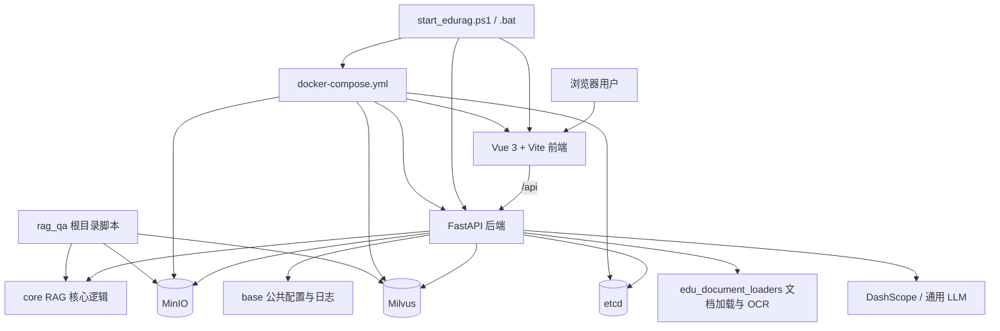
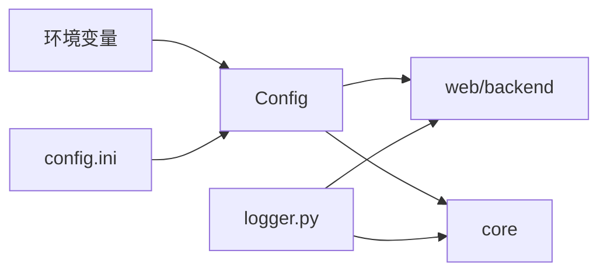
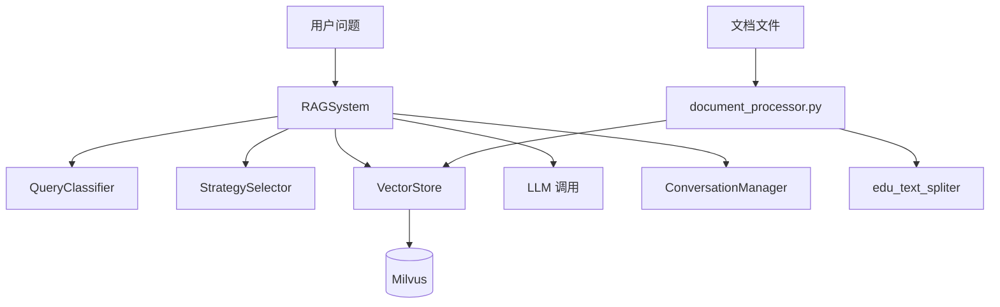
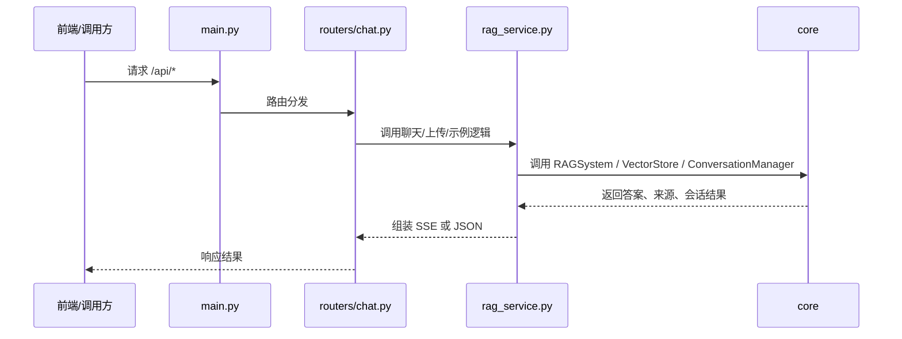

# Graduation-Project 技术文档

## 0. 文档合并与置信度基线

结论：当前项目中确实存在多份项目文档和技术文档，而且它们的用途、更新频率和事实可信度并不相同。这份 TECHNICAL_DOCUMENTATION.md 已作为“按置信度合并后的主文档”使用，下面给出本次合并时采用的置信度分层与合并原则。

### 0.1 置信度分层

#### 高置信事实源

这些文件要么直接声明文档边界，要么与当前运行链路强绑定，冲突时优先采用：

| 文档/文件 | 置信度 | 用途 |
| --- | --- | --- |
| README.md | 高 | 工作区级启动、编排、端口和运行入口事实源 |
| rag_qa/README.md | 高 | 应用层快速开始、环境变量、运行方式事实源 |
| rag_qa/项目使用指南.md | 高 | 当前工程版联调、依赖矩阵、排障事实源 |
| rag_qa/PROJECT_STRUCTURE.md | 高 | 当前真实目录结构和目录职责事实源 |
| start_edurag.ps1 | 高 | 本地启动、环境注入、端口选择的最终实现 |
| docker-compose.yml 及覆盖文件 | 高 | 基础设施和容器编排事实源 |
| rag_qa/web/backend/main.py、routers/*、rag_service.py | 高 | 后端公开 API 与运行行为事实源 |
| rag_qa/base/config.py | 高 | 配置项、配置优先级与默认值事实源 |

#### 中置信解释型文档

这些文档适合解释系统，但一旦与高置信事实源冲突，以高置信文件为准：

| 文档 | 置信度 | 用途 |
| --- | --- | --- |
| rag_qa/TECHNICAL_HANDBOOK.md | 中 | AI 接手、模块导览、阅读顺序 |
| rag_qa/SYSTEM_ARCHITECTURE.md | 中 | 架构汇报、交接、答辩说明 |
| rag_qa/文档索引.md | 中 | 文档导航与阅读建议 |
| 专题文档，如 微信公众号采集agent说明.md、MODELS_README.md、会话管理使用指南.md | 中 | 单专题说明，适合补充主文档未展开的细节 |

#### 低置信或参考性文档

这些文档保留参考价值，但不应直接作为当前工程事实基线：

| 文档 | 置信度 | 原因 |
| --- | --- | --- |
| rag_qa/文档整理总结.md | 低 | 是一次整理过程总结，不是现行事实手册 |
| 早期实验性说明或历史报告类文档 | 低 | 容易保留旧结构、旧入口或过时结论 |
| 本地环境文件，如 rag_qa/config.ini | 低到中 | 仅能证明当前本机配置状态，不能天然代表团队标准配置 |

### 0.2 合并原则

1. 启动、端口、依赖、路由、配置项等“可执行事实”优先取自代码、脚本和 Compose。
2. 文档之间若冲突，优先级为：代码与脚本 > README / 使用指南 / 结构文档 > 技术总览类文档 > 历史总结类文档。
3. 无法从代码或高置信文档证实的内容，不补写为结论，而是保留为 [待补充] 或“当前未在代码中落地”。
4. 专题文档只在其负责的主题范围内吸收内容，不反向覆盖工作区级启动和应用级主链路说明。

### 0.3 合并结果

- 本文档是当前“统一版主文档”，已经把项目概述、启动、架构、模块、API、存储、配置和遗漏检查合并到了一个入口。
- 文档索引和原有文档仍保留，因为它们对专题阅读和按场景检索依然有用。
- 后续如果继续维护，建议把新增事实先落到代码或主 README，再同步回本文档，避免再次出现多份文档漂移。

### 0.4 推荐文档分层模型

只按“主文档 / README / 专题文档”三层划分还不够细，容易把启动事实、运行手册、架构说明和专题深挖重新混在一起。对当前仓库，更稳的做法是拆成 6 类：

| 层级 | 代表文档 | 应放内容 | 不应放内容 |
| --- | --- | --- | --- |
| L1 工作区入口层 | README.md | 第一次进入仓库时必须知道的启动入口、端口、最小依赖、文档导航 | 过细的模块实现、字段级 API、专题链路细节 |
| L2 稳定事实基线层 | TECHNICAL_DOCUMENTATION.md | 稳定工程事实，如数据落盘位置、服务职责、脚本边界、任务用途、配置映射、运行判定 | 某条链路的操作步骤细节、一次性排障记录 |
| L3 运行与排障手册层 | rag_qa/项目使用指南.md | 日常开发、联调、启动方式、依赖矩阵、故障定位、环境自检 | 架构汇报、全量目录索引 |
| L4 架构与接手层 | rag_qa/TECHNICAL_HANDBOOK.md、rag_qa/SYSTEM_ARCHITECTURE.md | 新成员或 AI 接手时需要的阅读顺序、系统分层、主数据流、交接/答辩视角说明 | 快速启动步骤的重复抄写、完整配置表 |
| L5 目录与导航层 | rag_qa/PROJECT_STRUCTURE.md、rag_qa/文档索引.md | 目录职责、入口边界、按场景找文档、按目录找代码 | 业务规则本身、排障过程 |
| L6 专题深挖层 | 微信公众号采集agent说明.md、MODELS_README.md、会话管理使用指南.md 等 | 单一子系统的深入说明、链路步骤、输入输出、限制条件 | 作为整个项目的启动事实源 |

### 0.5 各文档职责落位

| 文档 | 推荐层级 | 主职责 |
| --- | --- | --- |
| README.md | L1 | 工作区入口、快速启动、最小导航 |
| TECHNICAL_DOCUMENTATION.md | L2 | 稳定工程事实总表 |
| rag_qa/项目使用指南.md | L3 | 日常运行、联调、排障 |
| rag_qa/TECHNICAL_HANDBOOK.md | L4 | AI / 新成员快速接手 |
| rag_qa/SYSTEM_ARCHITECTURE.md | L4 | 汇报、交接、答辩视角架构 |
| rag_qa/PROJECT_STRUCTURE.md | L5 | 目录事实与入口边界 |
| rag_qa/文档索引.md | L5 | 文档导航和阅读顺序 |
| 各专题文档 | L6 | 子系统深挖 |

### 0.6 治理与执行文档补齐建议

对于当前这种规模已经明显超过“单脚本项目”的仓库，建议在工作区根目录额外保留 5 份轻量治理与执行文档：

| 文档 | 作用 |
| --- | --- |
| [PROJECT_CHARTER_AND_SCOPE.md](PROJECT_CHARTER_AND_SCOPE.md) | 固定项目目标、范围边界、非目标和成功标准 |
| [MILESTONES_AND_ITERATION_TRACKER.md](MILESTONES_AND_ITERATION_TRACKER.md) | 记录里程碑、当前进展、风险和下一步 |
| [TECHNICAL_DECISION_RECORD.md](TECHNICAL_DECISION_RECORD.md) | 记录关键技术取舍及其原因 |
| [DEVELOPMENT_TEST_RELEASE_BASELINE.md](DEVELOPMENT_TEST_RELEASE_BASELINE.md) | 固定开发、测试、发布前的最低统一口径 |
| [NEXT_WINDOW_HANDOFF.md](NEXT_WINDOW_HANDOFF.md) | 为新窗口继续开发提供当前状态、已验证项和下一步入口 |

这 5 份文档不替代主技术文档，而是补齐“为什么做、做到哪、为什么这样做、最低怎么验收、下个窗口从哪接”这几个当前仓库最缺的维度。

### 0.7 文档体系总关系表

为避免后续再出现“知道有很多文档，但不知道先看哪一份、每份负责什么”的问题，可以把当前仓库的文档体系整体理解为下面 8 个层次与入口：

| 层级 | 文档 | 主要回答的问题 | 典型使用时机 |
| --- | --- | --- | --- |
| G1 范围治理 | [PROJECT_CHARTER_AND_SCOPE.md](PROJECT_CHARTER_AND_SCOPE.md) | 项目为什么做、当前做什么、不做什么、成功标准是什么 | 想确认范围边界、非目标、阶段目标 |
| G2 迭代跟踪 | [MILESTONES_AND_ITERATION_TRACKER.md](MILESTONES_AND_ITERATION_TRACKER.md) | 当前做到哪、遗留什么、风险和下一步是什么 | 想恢复最近迭代上下文 |
| G3 决策留痕 | [TECHNICAL_DECISION_RECORD.md](TECHNICAL_DECISION_RECORD.md) | 为什么采用当前方案，而不是其他方案 | 想理解变更原因和关键取舍 |
| G4 开发发布口径 | [DEVELOPMENT_TEST_RELEASE_BASELINE.md](DEVELOPMENT_TEST_RELEASE_BASELINE.md) | 改完后最低要验证什么、发布前检查什么、跨窗口怎么同步文档 | 想知道怎么收尾一轮改动 |
| G5 接力快照 | [NEXT_WINDOW_HANDOFF.md](NEXT_WINDOW_HANDOFF.md) | 当前窗口结束时，下一窗口最少需要知道什么 | 想快速接续最近一轮工作 |
| L1 工作区入口层 | [README.md](README.md) | 整个工作区怎么启动、根目录入口在哪里 | 第一次进入仓库或首次拉起项目 |
| L2 稳定事实基线层 | [TECHNICAL_DOCUMENTATION.md](TECHNICAL_DOCUMENTATION.md) | 当前稳定工程事实是什么，如数据落盘、服务职责、脚本边界、任务用途、配置映射、运行判定 | 需要核对“现在真实是怎样” |
| L2.5 应用入口层 | [rag_qa/README.md](rag_qa/README.md) | 进入应用主体后，最少需要知道哪些入口、运行方式和应用层说明 | 已进入 `rag_qa/`，想快速开始 |
| L3-L6 应用说明层 | [rag_qa/项目使用指南.md](rag_qa/%E9%A1%B9%E7%9B%AE%E4%BD%BF%E7%94%A8%E6%8C%87%E5%8D%97.md)、[rag_qa/TECHNICAL_HANDBOOK.md](rag_qa/TECHNICAL_HANDBOOK.md)、[rag_qa/SYSTEM_ARCHITECTURE.md](rag_qa/SYSTEM_ARCHITECTURE.md)、[rag_qa/PROJECT_STRUCTURE.md](rag_qa/PROJECT_STRUCTURE.md)、[rag_qa/文档索引.md](rag_qa/%E6%96%87%E6%A1%A3%E7%B4%A2%E5%BC%95.md)、各专题文档 | 怎么运行、怎么排障、怎么接手、目录怎么找、专题链路怎么深挖 | 按具体问题深入阅读 |

### 0.8 最小阅读路径总索引

对于当前项目，最常见的 4 种阅读路径可以直接固定下来：

| 目标 | 最小阅读路径 |
| --- | --- |
| 第一次进入仓库 | [README.md](README.md) -> [TECHNICAL_DOCUMENTATION.md](TECHNICAL_DOCUMENTATION.md) -> [rag_qa/README.md](rag_qa/README.md) |
| 恢复最近开发上下文 | [NEXT_WINDOW_HANDOFF.md](NEXT_WINDOW_HANDOFF.md) -> [MILESTONES_AND_ITERATION_TRACKER.md](MILESTONES_AND_ITERATION_TRACKER.md) -> [TECHNICAL_DECISION_RECORD.md](TECHNICAL_DECISION_RECORD.md) -> [TECHNICAL_DOCUMENTATION.md](TECHNICAL_DOCUMENTATION.md) |
| 准备修改代码 | [DEVELOPMENT_TEST_RELEASE_BASELINE.md](DEVELOPMENT_TEST_RELEASE_BASELINE.md) -> [TECHNICAL_DOCUMENTATION.md](TECHNICAL_DOCUMENTATION.md) -> 受影响入口代码 |
| 新接手或新窗口继续开发 | [NEXT_WINDOW_HANDOFF.md](NEXT_WINDOW_HANDOFF.md) -> [PROJECT_CHARTER_AND_SCOPE.md](PROJECT_CHARTER_AND_SCOPE.md) -> [MILESTONES_AND_ITERATION_TRACKER.md](MILESTONES_AND_ITERATION_TRACKER.md) -> [README.md](README.md) -> [TECHNICAL_DOCUMENTATION.md](TECHNICAL_DOCUMENTATION.md) |

补充说明：

- 如果问题是“项目当前真实如何运行”，优先看本文件，不优先看历史总结类文档。
- 如果问题是“这轮改了什么、为什么这么改”，优先看治理文档，不要只翻聊天记录。
- 如果问题是“某个专题链路怎么跑”，再转到 `rag_qa/` 下对应专题文档。

信息来源：基于 [README.md](README.md#L1)、[rag_qa/README.md](rag_qa/README.md#L1)、[rag_qa/项目使用指南.md](rag_qa/项目使用指南.md#L1)、[rag_qa/PROJECT_STRUCTURE.md](rag_qa/PROJECT_STRUCTURE.md#L1)、[rag_qa/文档索引.md](rag_qa/文档索引.md#L1)、[rag_qa/TECHNICAL_HANDBOOK.md](rag_qa/TECHNICAL_HANDBOOK.md#L1)、[rag_qa/SYSTEM_ARCHITECTURE.md](rag_qa/SYSTEM_ARCHITECTURE.md#L1)、[start_edurag.ps1](start_edurag.ps1#L1)、[docker-compose.yml](docker-compose.yml#L1)、[rag_qa/base/config.py](rag_qa/base/config.py#L1)、[rag_qa/web/backend/main.py](rag_qa/web/backend/main.py#L1)。

## 1. 项目概述

Graduation-Project 的应用主体是 rag_qa 子项目，对外提供一个面向采矿安全场景的 EduRAG 智能问答系统。系统以后端 FastAPI 服务承载认证、会话、知识库、反馈、数据集与公众号标注等接口，以前端 Vue 3 + Vite 应用提供交互界面，并在应用层集成基于 RAG 的问答、权限控制、知识库版本管理、反馈闭环与可观测性能力。

### 核心功能列表

- RAG 智能问答：提供基于检索增强生成的采矿安全知识问答能力。
- Web 前后端应用：后端使用 FastAPI 暴露 REST API，前端使用 Vue 3 + Vite 提供浏览器交互界面。
- 用户认证与权限控制：后端注册了 users、auth 路由，支持用户管理与认证接口。
- 会话与对话管理：后端注册了 chat、sessions 路由，支持问答与会话管理。
- 知识库与版本管理：后端注册了 knowledge、kb-version 路由，支持知识库管理和知识库版本管理。
- 用户反馈闭环：后端注册了 feedback 路由，支持反馈采集。
- 数据集与测试集生成：后端注册了 dataset、testgen 路由，支持数据集管理和测试集生成。
- 公众号标注能力：后端注册了 wechat-annotator 路由，提供独立的公众号标注接口。
- 可观测性支持：后端暴露 health 和 metrics 接口，并在请求中间件中记录日志与 Prometheus 指标。

信息来源：基于 [README.md](README.md)、[rag_qa/README.md](rag_qa/README.md)、[rag_qa/web/backend/main.py](rag_qa/web/backend/main.py#L1)、[rag_qa/web/frontend/package.json](rag_qa/web/frontend/package.json#L1)。

## 2. 快速启动

### 环境要求

- 操作系统：Windows 已提供一键启动脚本，仓库同时提供 Docker Compose 编排文件。
- Python 环境：项目默认使用 rag_qa/.venv 作为 Python 运行环境，后端任务直接调用 rag_qa/.venv/Scripts/python.exe。
- Node.js：最低建议 18.x LTS。依据是前端容器镜像固定为 `node:18-alpine`，本地开发与容器基线保持一致时最稳。
- npm：最低建议 9.x。依据是前端 [rag_qa/web/frontend/package-lock.json](rag_qa/web/frontend/package-lock.json#L1) 使用 `lockfileVersion: 3`，应使用与之兼容的 npm 安装依赖。
- Docker Desktop：最低建议 4.x+，并要求本机可用 `docker compose` v2；根目录 docker-compose.yml、覆盖文件和当前启动文档均按 Compose v2 命令编排。
- 关键端口：默认后端 8000，前端 5173，MinIO 宿主机 19000 和 19001，Milvus 宿主机 19530。

### 安装步骤

1. 创建并激活 Python 虚拟环境。

```powershell
cd rag_qa
python -m venv .venv
.venv\Scripts\activate
pip install -r requirements.txt
```

2. 复制环境变量模板并填写真实配置。

```powershell
cd ..
Copy-Item .env.example .env
```

3. 安装前端依赖。

```powershell
cd rag_qa\web\frontend
npm install
```

### 运行命令

#### 方式一：Windows 一键启动（推荐）

适用场景：日常开发、本地联调、给非后端同学提供一键可运行入口。

前提条件：

- 当前工作目录位于项目根目录 Graduation-Project。
- 已准备 rag_qa/.venv，且其中的 Python 依赖已安装完成。
- Docker Desktop 已启动，以便拉起 MinIO、etcd 和 Milvus。
- 前端依赖已安装，或允许启动器在现有 node_modules 基础上直接启动前端。

在项目根目录运行 PowerShell 启动器或双击批处理启动器：

```powershell
Set-ExecutionPolicy -Scope Process -ExecutionPolicy Bypass
./start_edurag.ps1
```

或直接运行：

```powershell
./start_edurag.bat
```

启动器会负责：

- 自动定位 rag_qa/.venv，并直接使用 rag_qa/.venv/Scripts/python.exe 作为解释器，不要求用户先手动 activate。
- 通过 docker compose 拉起 MinIO、etcd 和 Milvus。
- 自动选择可用端口；若 8000、5173、19000、19001、19530 被占用，会尝试近邻端口或随机高位端口。
- 启动本地 FastAPI 后端和本地 Vite 前端。
- 将实际使用的端口和启动过程写入 rag_qa/logs/launcher/launcher-latest.log。

推荐检查项：

1. 浏览器是否成功打开前端页面。
2. 后端健康检查是否可访问，例如 http://127.0.0.1:8000/api/health；若端口已回退，以 launcher 日志中的实际端口为准。
3. MinIO 与 Milvus 是否已被启动并监听实际分配端口。

注意：这是当前文档定义的“推荐工程联调模式”，启动器现在会一并拉起 MinIO、etcd 和 Milvus。

#### 方式二：手动前后端联调

适用场景：需要精细控制前后端启动顺序、单独查看日志、只重启某一侧组件。

前提条件：

- rag_qa/.venv 可用。
- rag_qa/web/frontend 已执行过 npm install。
- MinIO、Milvus 至少已通过 docker compose 或其他方式准备好。

后端：

```powershell
cd rag_qa\web\backend
..\..\.venv\Scripts\python.exe -m uvicorn main:app --reload --reload-dir ..\..\web\backend --reload-dir ..\..\core --reload-dir ..\..\base --host 0.0.0.0 --port 8000
```

需要稳定联调时，建议使用不带热重载的模式：

```powershell
cd rag_qa\web\backend
..\..\.venv\Scripts\python.exe -m uvicorn main:app --host 0.0.0.0 --port 8000
```

前端：

```powershell
cd rag_qa\web\frontend
npm run dev -- --host 127.0.0.1 --port 5173
```

如果后端没有运行在 8000，需要先显式设置前端代理目标：

```powershell
$env:VITE_API_PROXY_TARGET = 'http://127.0.0.1:8001'
cd rag_qa\web\frontend
npm run dev -- --host 127.0.0.1 --port 5173
```

也可以直接使用 VS Code 任务 Env: Self-check (.venv)、Backend: Run Uvicorn (.venv)、Backend: Run Uvicorn Stable (.venv)、Frontend: Run Vite 和 Project: Run stable local app。

推荐检查项：

1. 后端进程日志中无立即退出错误，且 /api/health 返回 200。
2. 前端页面可打开，登录页或主页面能正常渲染。
3. 如果前端请求出现 404，优先检查 VITE_API_PROXY_TARGET 是否与后端实际端口一致。

#### 方式三：Docker Compose 启动

适用场景：容器化验证、部署预演、快速确认一体化镜像是否可起。

```powershell
docker compose -f docker-compose.yml up -d
```

等价的显式写法为：

```powershell
docker compose up -d minio etcd milvus backend frontend
```

该方式会启动 minio、etcd、milvus、backend、frontend 五类服务，其中 backend 和 frontend 由镜像构建，其余基础设施使用预置镜像。

与方式一的关键区别：

- 方式一是“本地 backend/frontend + Compose 基础设施”的混合联调模式。
- 方式三是“backend/frontend 也容器化”的一体化验证模式。
- 方式三更适合环境验证，不是当前文档定义的首选开发模式。

推荐检查项：

1. docker compose ps 中五类服务状态为 running。
2. 前端页面可访问。
3. 后端 /api/health 返回 200。
4. 若需要知识库检索能力，确认后端连接到 Compose 拉起的 Milvus 实例。

#### 启动完成判定

当前项目不宜把“进程起来了”简单等同于“启动合格”，因为基础设施是否可用会直接影响入库与检索链路。因此更准确的做法是分级判断：

1. 进程级合格启动：前端与后端进程已成功拉起，后端 /api/health 返回 200，前端页面能打开。这说明 Web 应用已经启动成功。
2. 工程联调级合格启动：在进程级合格基础上，MinIO 也已可用，登录、基础页面、文件列表、公众号标注等不依赖向量检索深链路的功能可以工作。这是当前“推荐启动方式”通常追求的合格标准。
3. 完整能力级合格启动：在工程联调级基础上，Milvus 也已可连接，知识入库、知识库统计、RAG 检索和依赖向量库的问答链路可正常工作。这才是“完整功能可用”的启动。

#### 缺少部分组件时是否算合格启动

- 若前端和后端都没起来，或后端健康检查失败，不算合格启动。
- 若前后端已起来、MinIO 正常，但 Milvus 未启动或不可连接，这仍可算“工程联调级合格启动”，但不能算“完整能力级合格启动”。
- 若只有前端页面能打开、后端未就绪，也不算合格启动，因为前端无法形成有效联调闭环。
- 若只启动了轻量标注入口 wechat_annotator_main.py，并且目标本来就是公众号标注，那么它对“标注子系统”而言是合格启动，但不是主系统的完整启动。

当前代码中的依据包括：

- main.py 的 /api/health 直接返回 status=ok，说明后端可用性至少有显式健康检查入口。
- rag_service.py 在知识库统计失败时会做降级返回，而不是直接使服务启动失败。
- dataset.py 在对象存储初始化失败时也包含降级分支，说明系统设计上允许部分依赖异常时页面继续工作。
- 项目使用指南已明确说明：没有 Milvus 时，登录、基础页面、公众号标注等链路通常仍可部分工作；知识入库、RAG 检索、知识库统计则需要额外保证 Milvus 可用。

### 补充说明

- .env.example 中定义了 LLM、JWT、MinIO、Milvus、日志等主要配置项，启动前应将演示值替换为真实值。
- 若使用 VS Code，仓库已提供 Env: Self-check (.venv) 和 Repo: Self-check 两个自检任务。
- README、rag_qa/README.md 与本文件现已统一环境基线：Python 3.8+、Node.js 18.x LTS、npm 9+、Docker Desktop 4.x+ 且支持 `docker compose` v2。

信息来源：基于 [start_edurag.ps1](start_edurag.ps1#L1)、[start_edurag.bat](start_edurag.bat#L1)、[README.md](README.md#L80)、[rag_qa/项目使用指南.md](rag_qa/项目使用指南.md#L13)、[docker-compose.yml](docker-compose.yml#L1)、[rag_qa/web/backend/main.py](rag_qa/web/backend/main.py#L45)、[rag_qa/web/backend/rag_service.py](rag_qa/web/backend/rag_service.py#L337)、[rag_qa/web/backend/routers/dataset.py](rag_qa/web/backend/routers/dataset.py#L189)、[.vscode/tasks.json](.vscode/tasks.json#L1)。

## 3. 架构设计

### 整体架构图



### 模块划分与依赖关系

当前仓库可以分为工作区编排层和 rag_qa 应用主体层两级。工作区根目录负责启动编排、Docker Compose、VS Code 任务与运维配置；rag_qa 负责 Web 前后端、RAG 核心、文档加载器、文本切分器、测试、模型和实验脚本。后端主入口在 web/backend/main.py 中统一注册 users、auth、feedback、kb-version、chat、sessions、knowledge、dataset、testgen、wechat-annotator 路由，说明 API 层以路由模块为边界进行装配。

从实际导入关系看，后端主链路依赖关系为 web/backend/main.py -> routers -> rag_service.py -> core 与 base。rag_service.py 直接导入 base.Config、base.logger、core.conversation_manager、core.vector_store、core.new_rag_system，并通过 OpenAI 客户端连接外部 LLM；chat 路由还直接依赖 edu_document_loaders.OCRIMGLoader，说明后端不仅调用核心问答模块，也负责触发图片 OCR 和上传处理。前端主链路依赖关系为 src/main.js -> src/router/index.js，路由守卫再依赖 src/store.js 中的登录态；接口调用集中在 src/api/index.js，通过 axios 统一访问 /api 前缀的后端接口，因此前端的页面、路由、状态和 API 调用是分层组织的。

#### 模块依赖摘要

| 模块 | 主要职责 | 直接依赖线索 |
| --- | --- | --- |
| 工作区根目录 | 启动编排、Compose 基础设施、任务与运维 | start_edurag.ps1 调用 rag_qa 前后端目录并协调端口；docker-compose.yml 定义 minio、etcd、milvus、backend、frontend |
| rag_qa/web/frontend | 页面渲染、路由守卫、调用后端 API | main.js 依赖 router；router/index.js 依赖 store；api/index.js 通过 axios 调用 /api |
| rag_qa/web/backend | FastAPI 应用装配、请求中间件、路由注册 | main.py 导入 routers 与 base，并暴露 health、metrics |
| rag_qa/core | 对话管理、向量检索、RAG 主流程 | rag_service.py 直接导入 conversation_manager、vector_store、new_rag_system |
| rag_qa/base | 配置、日志、告警 | main.py 与 rag_service.py 都直接导入 Config、logger 等公共能力 |
| rag_qa/edu_document_loaders | 文档加载、图片 OCR | chat.py 直接导入 OCRIMGLoader |
| 外部依赖服务 | 对象存储、向量检索、键值元数据协调、LLM | docker-compose.yml 声明 MinIO/etcd/Milvus；rag_service.py 使用 Milvus 配置和 OpenAI 客户端；启动器现已把 MinIO 与 Milvus 纳入一键启动 |

信息来源：基于 [rag_qa/SYSTEM_ARCHITECTURE.md](rag_qa/SYSTEM_ARCHITECTURE.md#L1)、[rag_qa/PROJECT_STRUCTURE.md](rag_qa/PROJECT_STRUCTURE.md#L1)、[rag_qa/web/backend/main.py](rag_qa/web/backend/main.py#L1)、[rag_qa/web/backend/rag_service.py](rag_qa/web/backend/rag_service.py#L1)、[rag_qa/web/backend/routers/chat.py](rag_qa/web/backend/routers/chat.py#L21)、[rag_qa/web/frontend/src/main.js](rag_qa/web/frontend/src/main.js#L1)、[rag_qa/web/frontend/src/router/index.js](rag_qa/web/frontend/src/router/index.js#L1)、[rag_qa/web/frontend/src/store.js](rag_qa/web/frontend/src/store.js#L1)、[rag_qa/web/frontend/src/api/index.js](rag_qa/web/frontend/src/api/index.js#L1)、[docker-compose.yml](docker-compose.yml#L1)。

## 4. 模块详情

说明：本节按 rag_qa 应用主体中的一级代码模块展开，优先覆盖 base、core、edu_document_loaders、edu_text_spliter、web/backend、web/frontend；模型目录、运行时数据目录和实验产物目录不作为业务模块逐一展开。

### 4.1 base

- 模块路径：rag_qa/base
- 核心类/文件（最多 5 个）：config.py、logger.py、__init__.py

关键业务流程：



模块说明：base 负责整个应用的基础配置和日志能力。Config 会优先读取 EDURAG_ 前缀环境变量，再回退到 config.ini 中的各分区配置，并向上层暴露 Milvus、LLM、分块参数、OCR、存储、日志与认证等配置项；logger.py 和 __init__.py 则作为后端与核心模块共享的日志和公共出口。

信息来源：基于 [rag_qa/base/config.py](rag_qa/base/config.py#L1)、[rag_qa/base/__init__.py](rag_qa/base/__init__.py)、[rag_qa/PROJECT_STRUCTURE.md](rag_qa/PROJECT_STRUCTURE.md#L74)。

### 4.2 core

- 模块路径：rag_qa/core
- 核心类/文件（最多 5 个）：new_rag_system.py、vector_store.py、conversation_manager.py、document_processor.py、strategy_selector.py

关键业务流程：



模块说明：core 是问答和检索主链路所在层。new_rag_system.py 中的 RAGSystem 负责查询分类、策略选择、检索合并和答案生成；vector_store.py 负责 BGE-M3 向量化、Milvus 集合创建、混合检索和重排；conversation_manager.py 负责将会话持久化到 conversations 目录；document_processor.py 负责把多格式文档经过 loader 和 splitter 处理后送入向量库。该模块还包含 auth_manager、feedback_manager、knowledge_version_manager、user_manager 等业务管理组件，但本节仅列出主链路文件。

信息来源：基于 [rag_qa/core/new_rag_system.py](rag_qa/core/new_rag_system.py#L1)、[rag_qa/core/vector_store.py](rag_qa/core/vector_store.py#L1)、[rag_qa/core/conversation_manager.py](rag_qa/core/conversation_manager.py#L1)、[rag_qa/core/document_processor.py](rag_qa/core/document_processor.py#L1)、[rag_qa/PROJECT_STRUCTURE.md](rag_qa/PROJECT_STRUCTURE.md#L52)。

### 4.3 edu_document_loaders

- 模块路径：rag_qa/edu_document_loaders
- 核心类/文件（最多 5 个）：__init__.py、edu_pdfloader.py、edu_docloader.py、edu_pptloader.py、edu_imgloader.py

关键业务流程：

文字流程：根据文件扩展名选择对应加载器，文本型文件直接提取文本，PDF、Word、PPT 和图片文件走 OCR 或内容抽取逻辑，再统一返回 Document 列表给 core/document_processor.py。以 OCRPDFLoader 为例，模块先尝试读取 OCR 缓存，未命中时逐页提取文本，并对满足尺寸阈值的页面图片执行 OCR，最后增量保存和落盘完整缓存。

信息来源：基于 [rag_qa/edu_document_loaders/__init__.py](rag_qa/edu_document_loaders/__init__.py#L1)、[rag_qa/edu_document_loaders/edu_pdfloader.py](rag_qa/edu_document_loaders/edu_pdfloader.py#L1)、[rag_qa/core/document_processor.py](rag_qa/core/document_processor.py#L1)、[rag_qa/PROJECT_STRUCTURE.md](rag_qa/PROJECT_STRUCTURE.md#L53)。

### 4.4 edu_text_spliter

- 模块路径：rag_qa/edu_text_spliter
- 核心类/文件（最多 5 个）：__init__.py、edu_chinese_recursive_text_splitter.py、hybrid_semantic_text_splitter.py、edu_model_text_spliter.py、review.py

关键业务流程：

文字流程：document_processor.py 会先构造父块切分器，再根据 EDURAG_CHUNKING_MODE 和 EDURAG_CHUNKING_MODE_BY_SOURCE 选择规则切分或混合语义切分。HybridSemanticTextSplitter 先按段落结构拆分，再按句向量相似度寻找语义断点，若切分结果仍过长，则回退到 fallback_splitter 做长度切分，最后再附加 overlap。

信息来源：基于 [rag_qa/edu_text_spliter/__init__.py](rag_qa/edu_text_spliter/__init__.py#L1)、[rag_qa/edu_text_spliter/hybrid_semantic_text_splitter.py](rag_qa/edu_text_spliter/hybrid_semantic_text_splitter.py#L1)、[rag_qa/core/document_processor.py](rag_qa/core/document_processor.py#L17)、[rag_qa/PROJECT_STRUCTURE.md](rag_qa/PROJECT_STRUCTURE.md#L54)。

### 4.5 web/backend

- 模块路径：rag_qa/web/backend
- 核心类/文件（最多 5 个）：main.py、rag_service.py、schemas.py、routers/chat.py、routers/users.py

关键业务流程：



模块说明：web/backend 是 FastAPI API 装配层。main.py 负责注册 users、auth、feedback、kb-version、chat、sessions、knowledge、dataset、testgen、wechat-annotator 路由，同时挂载请求日志中间件、异常处理、health 和 metrics；schemas.py 定义 Pydantic 请求与响应模型；rag_service.py 负责流式问答、查询路由、模型级分流、证据状态汇总、运行时配置刷新与降级；routers/chat.py 负责把聊天请求、图片 OCR 问答、来源详情和示例接口暴露为 HTTP API。其余路由文件分别覆盖认证、会话、知识库、反馈、测试集生成和公众号标注。

补充说明：聊天链路里的最终 `query_type` 不是“查询分类模型输出什么就直接展示什么”。当前运行逻辑是先由 `core/query_classifier.py` 给出“通用知识/专业咨询”预测，再由 `rag_service.py` 中的 `_normalize_query_type()`、`_promote_query_type_by_retrieval()` 和 `_prepare_query_plan()` 做后置修正。现行规则与早期版本相比有四点关键变化：

1. 通用知识与专业咨询已改成模型级分流，而不是只靠 prompt 区分。通用知识主回答走 `GENERAL_LLM_MODEL` / `GENERAL_API_KEY` / `GENERAL_BASE_URL` 对应的独立客户端；专业咨询主回答走 `LLM_MODEL`；“通用 LLM 对比回答”只在前端显式触发且当前问题仍属于专业咨询时才会额外生成。
2. `_normalize_query_type()` 只保留“明显跨领域问题直接降为通用知识”和“低置信度专业问题降为通用知识”的保守规则，不再因为出现领域词就硬拉为专业咨询。
3. `_promote_query_type_by_retrieval()` 现在要求同时满足领域信号、非边界负样本以及可用的 rerank 证据，才会把“通用知识”提升为“专业咨询”；像就业、简历、面试、学习计划这类“带矿业语境但本质是通用问题”的问法，不会再被轻易升级。
4. `_prepare_query_plan()` 除了输出来源列表，还会计算 `evidence_note` 与每条来源的 `evidence_status/evidence_note`。当出现“父块主题命中但缺少稳定子块证据”时，系统会把这条证据状态同时暴露给右侧检索面板，并注入左侧主回答上下文，避免出现“右侧看起来命中很高，左侧却只说依据不足”的语义冲突。

额外说明：专业问题未命中或证据不足时，当前专业 prompt 不再默认要求联系人工客服，而是优先要求用户补充场景、设备、工艺环节、事故类型或时间范围；只有高风险现场操作、事故处置、制度性核验且当前证据不足以安全作答时，才建议转人工。

信息来源：基于 [rag_qa/web/backend/main.py](rag_qa/web/backend/main.py#L1)、[rag_qa/web/backend/rag_service.py](rag_qa/web/backend/rag_service.py#L1)、[rag_qa/web/backend/schemas.py](rag_qa/web/backend/schemas.py#L1)、[rag_qa/web/backend/routers/chat.py](rag_qa/web/backend/routers/chat.py#L1)、[rag_qa/PROJECT_STRUCTURE.md](rag_qa/PROJECT_STRUCTURE.md#L55)。

### 4.6 web/frontend

- 模块路径：rag_qa/web/frontend
- 核心类/文件（最多 5 个）：src/main.js、src/App.vue、src/router/index.js、src/api/index.js、src/store.js

关键业务流程：

文字流程：src/main.js 创建 Vue 应用并装配 Element Plus 与 router；src/router/index.js 定义登录、问答、知识库、配置、驾驶仓、员工管理和公众号标注等页面路由，并通过 useStore() 实现登录态和主管权限守卫；src/api/index.js 统一通过 axios 访问 /api，自动注入 Bearer Token，并在 401 时清理本地登录态；src/App.vue 负责渲染顶部导航、用户资料弹窗、系统在线状态，并通过 router-view 装载各页面视图。

前端运行时口径更新：

1. ChatView.vue 的右侧“检索分析”已改成“命中证据”视图，不再把加工后的 `display_score` 宣称为“相似度”。当前界面会明确拆开展示 `score`（主展示命中分，现已回到真实子块检索分）、`search_score`（检索分）、`rerank_score`（重排分），并对“仅命中父块主题相关内容，缺少稳定子块证据”这类情况直接显示结构化证据说明。
2. ConfigView.vue 现在会显示三条模型链路：专业回答模型、通用直答模型、对比回答模型；对应数据来自 `/api/knowledge/status` 返回的 `llm_model`、`general_llm_model`、`compare_llm_model` 以及各自的依赖状态。
3. DashboardView.vue 的反馈追溯已支持按用户分组，再按点赞、点踩、部分正确、纠错四类做二级折叠，并提供“展开类型 / 收起类型”批量操作。
4. 登录与聊天主工作台的失败口径已从“toast 优先”调整为“页面内状态优先”：LoginView.vue 使用内联错误条展示 401/404 等登录失败；ChatView.vue 使用 `workspaceActionFeedback` 承接侧边栏工作流结果，使用 `composerNotice` 承接发送失败与首次建会话失败，流式中断则保留在消息元数据中。
5. ChatView.vue 当前已把会话创建/删除、反馈提交/撤销、测试集文件追加、主管权限校验等结果统一进左侧工作台反馈区；聊天请求失败不再额外弹重复 toast，而是通过输入区失败状态与消息内中断标记共同表达。
6. WechatAnnotatorView.vue 当前已为本地账号匹配、桌面 profile / 桌面采集、Agent 执行三组高频动作提供页面内结果条；此前模板已无入口的按链接抓取、按历史页抓取和相关 `crawl*` 状态、辅助函数、API import 已清理，保留的文章定位辅助函数仅继续服务于 Agent 成功后的自动跳转。
7. 公众号 Agent 当前的产品形态应理解为“有限 ReAct 外壳 + LLM 规划层 + 确定性工具执行”，而不是开放式通用自治 Agent。前端现在会把大脑状态、能力边界、结构化执行计划、当前短期记忆和账号锁定状态直接展示出来，让用户能看到“它为什么这么做”。
8. WechatAnnotatorView.vue 已接入浏览器会话级 `session_memory`，会记录最近账号、显示名、历史页、最近文章、最近失败原因、最近决策，并支持“锁定当前账号上下文 / 解除账号锁定 / 清空短期记忆”。锁定态也已改为显式徽标和高亮 banner，而不再只是文案前缀。
9. Agent 执行完成后的顶部结果条，现已和下方阶段日志共用同一份执行摘要事实源。顶部反馈会先展示真实执行摘要，再在零新增场景下附加原因判断，避免“顶部一句话”和“阶段日志事实”相互冲突。
10. 前端工程侧已完成路由懒加载、Element Plus 按需导入与基础 PWA 接入。当前构建仍会提示 `vue-core` chunk 约 625KB，但这已不再作为当前交互治理阶段的主线问题。
11. WechatAnnotatorView.vue 现已把公众号 Agent 的多 Agent 编排直接展示在页面中。用户在执行完成后可以看到 `orchestration.task.status`、`current_agent`、`next_agent`、`route`、`completed_agents`、治理结果和评测优化结果，而不是只能从原始日志猜测后端执行到了哪一步。
12. 当前前端展示的“多 Agent 编排”并不代表浏览器侧自己协调多个自治体，而是直接消费后端返回的 `orchestration` 对象。页面会把其中的 `governance_report` 和 `evaluation_report` artifact 解析成卡片摘要，同时把这部分状态持久化到浏览器会话级面板快照里，刷新后仍可恢复。

补充页面入口：当前视图目录中实际存在 LoginView.vue、ChatView.vue、KnowledgeView.vue、ConfigView.vue、DashboardView.vue、EmployeeManageView.vue、WechatAnnotatorView.vue。

信息来源：基于 [rag_qa/web/frontend/src/main.js](rag_qa/web/frontend/src/main.js#L1)、[rag_qa/web/frontend/src/App.vue](rag_qa/web/frontend/src/App.vue#L1)、[rag_qa/web/frontend/src/router/index.js](rag_qa/web/frontend/src/router/index.js#L1)、[rag_qa/web/frontend/src/api/index.js](rag_qa/web/frontend/src/api/index.js#L1)、[rag_qa/web/frontend/src/store.js](rag_qa/web/frontend/src/store.js#L1)、[rag_qa/PROJECT_STRUCTURE.md](rag_qa/PROJECT_STRUCTURE.md#L56)。

### 4.7 公众号多 Agent 编排现状

当前公众号 Agent 已从“单一工具调用入口”演进为“中心编排器 + 专用子 Agent”的单服务内编排实现，但它仍然是仓库内本地执行的协议化多 Agent，不是跨进程、跨服务部署的完整 A2A 网络。

稳定事实如下：

1. 后端编排协议版本当前固定为 `v1`，编排器名称固定为 `knowledge_orchestrator`。
2. 当前采集类任务的标准 route 固定为三段：`knowledge_acquisition_agent` -> `knowledge_governance_agent` -> `evaluation_optimization_agent`。
3. `run_agent_command` 与 `run_agent_command_stream` 在完成阶段都会返回 `orchestration` 对象，其中包含 `task`、`shared_context`、`artifacts`、`review`、`handoffs`、`completed_agents` 和 `next_agent`。
4. 采集成功且生成了知识资产后，后端会自动尝试治理 handoff；治理成功后会继续自动触发评测优化 handoff。治理或评测失败不会回滚已完成的采集结果，而是通过 `partial_success` 或失败步骤反映在 review / orchestration 中。
5. 当前评测优化 Agent 仍以规则驱动骨架为主，不会远程调度外部评测服务；它主要基于治理报告中的重复文档、元数据缺失、正文质量和标注覆盖率，生成 `quality_score`、`coverage_score`、`readiness` 与建议列表。
6. 当本地存在官方 RAGAS 评测结果快照时，评测优化 Agent 现在会自动尝试读取最新快照，并把 `faithfulness`、`context_precision`、`context_recall`、`response_relevancy`、`ragas_average` 以及快照来源信息一并写入 `evaluation_report`，供前端编排卡片展示。
7. 当前系统已经提供独立调试入口 `POST /api/wechat-annotator/agent/governance` 与 `POST /api/wechat-annotator/agent/evaluation`，但主产品链路仍以 `/agent` 或 `/agent/stream` 的统一入口触发自动 handoff 为主。
8. 同步抓取入口 `crawl_article_urls()` 现在会在返回中显式补齐 `created_articles`；当输入链接已在当前账号下存在时，会返回 `skipped_reason = all_duplicates`，而不是把“去重后为空”误报成抓取失败。这使得采集成功后的治理与评测 handoff 能继续依赖同一份同步结果事实源。
9. `evaluation_optimization_agent` 每次产出 `evaluation_report` 时，当前都会把摘要写入本地 `evaluation_history.json`，前端可通过独立接口读取最近几次评测历史并展示趋势，不再只能看单次结果。
10. WechatAnnotatorView.vue 当前已把 Agent 面板快照和判断统计恢复能力提升到 `localStorage` 级别；关闭标签页后再次进入，仍可恢复最近一次指令、短期记忆和判断统计。
11. WechatAnnotatorView.vue 当前除了入口判断诊断和 handoff 契约诊断外，还新增了“评测趋势”和“结构化失败原因”两块视图；其中评测趋势除了最近记录摘要外，还会把最近一段时间的 RAGAS 记录压成轻量趋势图，用来区分重复链接、频率控制、时间窗过滤、页面受限、治理失败和评测失败等不同场景。
12. 当前后端已经补充 `GET /api/wechat-annotator/agent/evaluation/history/compare` 与 `POST /api/wechat-annotator/agent/evaluation/history/{history_id}/rerun` 两个最小正式接口，前端可以直接查看同账号最近两次评测差值，并对最新历史记录执行一次手动重跑。
13. 当前后端还补充了 `GET/PUT/DELETE /api/wechat-annotator/agent/session-state`，用来把 Agent 面板快照和短期记忆按登录用户落到服务端本地文件；这意味着当前“继续上次任务”已经不再只依赖浏览器本地缓存。
14. 当前 Agent 协议定义已经从 [rag_qa/web/backend/routers/wechat_annotator.py](rag_qa/web/backend/routers/wechat_annotator.py) 内部常量抽到 [rag_qa/web/backend/routers/wechat_agent_protocol.py](rag_qa/web/backend/routers/wechat_agent_protocol.py)，`orchestration.protocol` 会把 Agent 列表与 handoff 模板一并返回给前端，减少后端和页面两边各写一套协议事实源的漂移风险。
15. WechatAnnotatorView.vue 当前的阶段卡与 handoff 契约卡已经优先消费 `orchestration.protocol` 渲染，新增第 4 个本地 Agent 时，不再要求先去页面里改一轮固定标题和顺序。
16. `orchestration.protocol.agents[*].summary_templates` 现已承载阶段卡默认摘要文案；前端只负责根据运行状态选择模板和填入少量动态变量，不再把三段 Agent 的默认摘要散落在页面逻辑里。
17. `POST /api/wechat-annotator/agent/evaluation` 现在也会返回完整 `orchestration`，与 `POST /api/wechat-annotator/agent/governance` 保持协议字段、当前 Agent 字段和完成态字段的一致口径。
18. `orchestration.protocol.agents[*].metric_templates` 现已承载阶段卡指标标签文案，例如解析源、决策、处理条数、风险等级、RAGAS 与样本数；页面只再负责决定哪些指标需要展示。
19. 前端构建配置 [rag_qa/web/frontend/vite.config.js](rag_qa/web/frontend/vite.config.js) 已把 Vue 运行时、Vue Router、Element Plus Core、Element Plus Icons、Floating UI 和按组件切分的 Element Plus 子块拆开，当前 `npm run build` 已不再出现超过 500 kB 的 chunk warning。
20. `orchestration.protocol.handoff_templates[*].input_rules` 现已承载 handoff 输入满足规则，例如 `governance_report` 需要 `governance_report` artifact、`created_articles` 与 `clean_result` 需要 `article_record` 或 `cleaning_result` artifact；前端 handoff 卡不再写死这些字符串判断。
21. 协议展示层已从 [rag_qa/web/frontend/src/views/WechatAnnotatorView.vue](rag_qa/web/frontend/src/views/WechatAnnotatorView.vue) 抽出到 [rag_qa/web/frontend/src/components/wechat/WechatAgentProtocolOverview.vue](rag_qa/web/frontend/src/components/wechat/WechatAgentProtocolOverview.vue)，当前 handoff 契约卡与阶段卡已经不再和任务执行面板写在同一模板块里。
22. 最近任务列表也已从主视图抽到 [rag_qa/web/frontend/src/components/wechat/WechatAgentTaskList.vue](rag_qa/web/frontend/src/components/wechat/WechatAgentTaskList.vue)，父页只保留任务数据、筛选状态与点击事件，列表模板和对应样式已不再内联在主视图中。
23. 任务详情弹窗已从主视图抽到 [rag_qa/web/frontend/src/components/wechat/WechatAgentTaskDetailDialog.vue](rag_qa/web/frontend/src/components/wechat/WechatAgentTaskDetailDialog.vue)，父页只继续持有选中任务、展开状态和跳转/复制动作，详情模板与响应式样式已迁出主视图。

当前不应被写大的点：

- 这套实现已经具备 A2A 兼容方向的协议字段和 handoff 语义，但当前代码中没有引入远程 Agent 注册、发现、跨服务传输或独立运行时治理。
- `evaluation_optimization_agent` 现在属于“可执行骨架 + 本地评测快照挂接”，而不是完整的离线评测平台；它适合演示链路闭环和后续扩展点，不应对外表述为生产级评测平台。

信息来源：基于 [rag_qa/web/backend/routers/wechat_annotator.py](rag_qa/web/backend/routers/wechat_annotator.py#L100)、[rag_qa/web/backend/routers/wechat_annotator.py](rag_qa/web/backend/routers/wechat_annotator.py#L434)、[rag_qa/web/backend/routers/wechat_annotator.py](rag_qa/web/backend/routers/wechat_annotator.py#L660)、[rag_qa/web/backend/routers/wechat_annotator.py](rag_qa/web/backend/routers/wechat_annotator.py#L926)、[rag_qa/web/backend/routers/wechat_annotator.py](rag_qa/web/backend/routers/wechat_annotator.py#L1076)、[rag_qa/web/backend/routers/wechat_annotator.py](rag_qa/web/backend/routers/wechat_annotator.py#L4676)、[rag_qa/web/backend/routers/wechat_annotator.py](rag_qa/web/backend/routers/wechat_annotator.py#L4781)、[rag_qa/web/frontend/src/views/WechatAnnotatorView.vue](rag_qa/web/frontend/src/views/WechatAnnotatorView.vue#L137)、[rag_qa/web/frontend/src/views/WechatAnnotatorView.vue](rag_qa/web/frontend/src/views/WechatAnnotatorView.vue#L165)。

## 5. API 接口规范

说明：下表仅列出当前后端 Controller/路由文件中实际注册的方法。路径由 main.py 中的 include_router 前缀与各 router 文件中的装饰器路径拼接得到；此外补充列出 main.py 自身直接声明的 /api/health 和 /metrics。

| HTTP | 路径 | 处理函数 | 所属文件 |
| --- | --- | --- | --- |
| POST | /api/auth/login | login | routers/auth.py |
| POST | /api/auth/logout | logout | routers/auth.py |
| GET | /api/auth/verify | verify_token | routers/auth.py |
| GET | /api/auth/credentials | get_demo_credentials | routers/auth.py |
| POST | /api/users/login | login | routers/users.py |
| POST | /api/users/logout | logout | routers/users.py |
| GET | /api/users/profile | get_profile | routers/users.py |
| PUT | /api/users/profile | update_profile | routers/users.py |
| POST | /api/users/profile/avatar | upload_avatar | routers/users.py |
| GET | /api/users/avatar/{avatar_name} | get_avatar | routers/users.py |
| GET | /api/users/employees | list_employees | routers/users.py |
| POST | /api/users/employees | create_employee | routers/users.py |
| PUT | /api/users/employees/{employee_id} | update_employee | routers/users.py |
| DELETE | /api/users/employees/{employee_id} | delete_employee | routers/users.py |
| POST | /api/feedback/submit | submit_feedback | routers/feedback.py |
| GET | /api/feedback/session/{session_id} | get_session_feedback | routers/feedback.py |
| GET | /api/feedback/user/{user_id} | get_user_feedback | routers/feedback.py |
| GET | /api/feedback/stats | get_feedback_stats | routers/feedback.py |
| GET | /api/feedback/all | get_all_feedbacks | routers/feedback.py |
| GET | /api/kb-version/list | list_versions | routers/kb_version.py |
| GET | /api/kb-version/current | get_current_version | routers/kb_version.py |
| GET | /api/kb-version/detail/{version} | get_version_detail | routers/kb_version.py |
| POST | /api/kb-version/create | create_version | routers/kb_version.py |
| POST | /api/kb-version/publish | publish_version | routers/kb_version.py |
| POST | /api/kb-version/rollback | rollback_version | routers/kb_version.py |
| POST | /api/chat/send | chat_send | routers/chat.py |
| GET | /api/chat/examples | get_examples | routers/chat.py |
| GET | /api/chat/source-detail | get_source_detail | routers/chat.py |
| POST | /api/chat/send-image | chat_send_image | routers/chat.py |
| GET | /api/sessions/ | list_sessions | routers/sessions.py |
| POST | /api/sessions/ | create_session | routers/sessions.py |
| GET | /api/sessions/{session_id}/messages | get_session_messages | routers/sessions.py |
| DELETE | /api/sessions/{session_id} | delete_session | routers/sessions.py |
| GET | /api/knowledge/status | get_status | routers/knowledge.py |
| GET | /api/knowledge/models/available | get_available_models | routers/knowledge.py |
| PUT | /api/knowledge/config/models | update_models | routers/knowledge.py |
| POST | /api/dataset/upload | upload_document | routers/dataset.py |
| GET | /api/dataset/files | list_files | routers/dataset.py |
| GET | /api/dataset/files/{file_id}/download | download_file | routers/dataset.py |
| GET | /api/dataset/files/legacy/download | download_legacy_file | routers/dataset.py |
| DELETE | /api/dataset/files/{file_id} | delete_file | routers/dataset.py |
| GET | /api/testgen/dataset-files | list_generated_dataset_files | routers/testgen.py |
| POST | /api/testgen/append | append_generated_dataset | routers/testgen.py |
| POST | /api/testgen/generate | generate_testset | routers/testgen.py |
| GET | /api/wechat-annotator/articles | list_articles | routers/wechat_annotator.py |
| GET | /api/wechat-annotator/accounts/search | search_accounts_by_name | routers/wechat_annotator.py |
| GET | /api/wechat-annotator/desktop/profiles | list_desktop_profiles | routers/wechat_annotator.py |
| DELETE | /api/wechat-annotator/desktop/profiles/{profile_name} | delete_desktop_profile | routers/wechat_annotator.py |
| POST | /api/wechat-annotator/desktop/capture | run_desktop_capture | routers/wechat_annotator.py |
| POST | /api/wechat-annotator/desktop/capture/stream | run_desktop_capture_stream | routers/wechat_annotator.py |
| GET | /api/wechat-annotator/articles/{account_id}/{article_id} | get_article | routers/wechat_annotator.py |
| GET | /api/wechat-annotator/articles/{account_id}/{article_id}/images/{image_id} | get_article_image | routers/wechat_annotator.py |
| POST | /api/wechat-annotator/articles/{account_id}/{article_id}/images/{image_id}/download-hires | attempt_hires_image_download | routers/wechat_annotator.py |
| GET | /api/wechat-annotator/articles/{account_id}/{article_id}/export-kept-images | export_kept_images | routers/wechat_annotator.py |
| PUT | /api/wechat-annotator/articles/{account_id}/{article_id}/annotations | save_annotations | routers/wechat_annotator.py |
| POST | /api/wechat-annotator/articles/{account_id}/{article_id}/apply-instruction | apply_instruction | routers/wechat_annotator.py |
| POST | /api/wechat-annotator/articles/{account_id}/{article_id}/autofill | autofill_annotations | routers/wechat_annotator.py |
| GET | /api/wechat-annotator/articles/{account_id}/{article_id}/review | get_review_payload | routers/wechat_annotator.py |
| POST | /api/wechat-annotator/crawl/article-urls | crawl_article_urls | routers/wechat_annotator.py |
| POST | /api/wechat-annotator/crawl/article-urls/stream | crawl_article_urls_stream | routers/wechat_annotator.py |
| POST | /api/wechat-annotator/crawl/account-history/stream | crawl_account_history_stream | routers/wechat_annotator.py |
| POST | /api/wechat-annotator/agent | run_agent_command | routers/wechat_annotator.py |
| POST | /api/wechat-annotator/agent/command | run_agent_command | routers/wechat_annotator.py |
| GET | /api/wechat-annotator/agent/tasks | list_agent_tasks | routers/wechat_annotator.py |
| GET | /api/wechat-annotator/agent/tasks/{task_id} | get_agent_task | routers/wechat_annotator.py |
| POST | /api/wechat-annotator/agent/tasks/{task_id}/retry | retry_agent_task | routers/wechat_annotator.py |
| POST | /api/wechat-annotator/agent/governance | run_knowledge_governance | routers/wechat_annotator.py |
| POST | /api/wechat-annotator/agent/evaluation | run_evaluation_optimization | routers/wechat_annotator.py |
| GET | /api/wechat-annotator/agent/evaluation/history | get_evaluation_history | routers/wechat_annotator.py |
| GET | /api/wechat-annotator/agent/evaluation/history/compare | get_evaluation_history_compare | routers/wechat_annotator.py |
| POST | /api/wechat-annotator/agent/evaluation/history/{history_id}/rerun | rerun_evaluation_history | routers/wechat_annotator.py |
| GET | /api/wechat-annotator/agent/session-state | get_agent_session_state | routers/wechat_annotator.py |
| PUT | /api/wechat-annotator/agent/session-state | save_agent_session_state | routers/wechat_annotator.py |
| DELETE | /api/wechat-annotator/agent/session-state | delete_agent_session_state | routers/wechat_annotator.py |
| POST | /api/wechat-annotator/agent/stream | run_agent_command_stream | routers/wechat_annotator.py |
| POST | /api/wechat-annotator/agent/command/stream | run_agent_command_stream | routers/wechat_annotator.py |
| GET | /api/health | health | main.py |
| GET | /metrics | metrics | main.py |

补充说明：当前代码中同时存在 auth.py 和 users.py 两套登录/登出相关接口，前端 src/api/index.js 实际调用的是 /api/users 下的登录、登出和 profile 接口，因此 /api/auth 更像兼容或并存的认证入口，文档中仍按代码现状全部列出。

公众号 Agent 流式接口补充说明：

- `POST /api/wechat-annotator/agent/stream` 是当前推荐的 SSE 流式入口；`POST /api/wechat-annotator/agent/command/stream` 继续作为兼容别名保留。
- 两个流式入口当前事件类型固定为 `loading`、`parsed`、`step_start`、`step_done`、`done`、`error`。
- `parsed` 事件除自然语言解析结果外，还会返回 `brain_source`、`intent_label`、`capability_supported`、`capability_message`、`plan_outline` 与标准化后的 `session_memory`、`account_locked`、`pinned_account_id`、`pinned_display_name`。
- `parsed` 事件当前还会给出 `protocol_version`、`task_type`、`agent_route` 与 `trace_id`，用于前端提前构建编排视图和后续跨窗口排查。
- `done` 事件当前统一返回 `data` 结构，其中除 `parsed`、`steps`、`annotation_entry` 与 `refreshed` 外，还可能包含 `task`、`updated_session_memory`、`governance`、`evaluation_optimization` 与 `orchestration`；前端完成反馈和阶段日志应共同以 `steps`、artifact 摘要和 `orchestration.review` 为事实源，而不是各自再推导一套原因。
- `orchestration` 当前是后端多 Agent 编排的主事实对象，至少包含 `task`、`shared_context`、`artifacts`、`review`、`handoffs`、`completed_agents` 和 `next_agent`；当前产品上看到的“多 Agent 编排”卡片即直接来自这个对象。
- 兼容入口 `/api/wechat-annotator/agent/command/stream` 已修复历史上的 `account_id` 闭包作用域异常，清洗步骤不再因为旧变量名复用而中断。

信息来源：基于 [rag_qa/web/backend/main.py](rag_qa/web/backend/main.py#L1)、[rag_qa/web/backend/routers/auth.py](rag_qa/web/backend/routers/auth.py#L1)、[rag_qa/web/backend/routers/users.py](rag_qa/web/backend/routers/users.py#L1)、[rag_qa/web/backend/routers/feedback.py](rag_qa/web/backend/routers/feedback.py#L1)、[rag_qa/web/backend/routers/kb_version.py](rag_qa/web/backend/routers/kb_version.py#L1)、[rag_qa/web/backend/routers/chat.py](rag_qa/web/backend/routers/chat.py#L1)、[rag_qa/web/backend/routers/sessions.py](rag_qa/web/backend/routers/sessions.py#L1)、[rag_qa/web/backend/routers/knowledge.py](rag_qa/web/backend/routers/knowledge.py#L1)、[rag_qa/web/backend/routers/dataset.py](rag_qa/web/backend/routers/dataset.py#L1)、[rag_qa/web/backend/routers/testgen.py](rag_qa/web/backend/routers/testgen.py#L1)、[rag_qa/web/backend/routers/wechat_annotator.py](rag_qa/web/backend/routers/wechat_annotator.py#L1247)、[rag_qa/web/frontend/src/api/index.js](rag_qa/web/frontend/src/api/index.js#L1)。

## 6. 数据库设计

说明：当前仓库的有效持久化结构已经收敛到 1 个 Milvus 集合、1 套对象存储路径，以及多类本地 JSON/Markdown/HTML 文件。MySQL 与 Redis 已从当前运行链路和基础编排中移除，不再是主系统依赖。

### 6.1 Milvus 向量集合

| 表名/集合 | 字段 | 说明 |
| --- | --- | --- |
| edurag_final | id | 主键，VARCHAR，使用文档内容 md5 作为唯一标识 |
| edurag_final | text | 子块文本内容 |
| edurag_final | dense_vector | 稠密向量字段，FLOAT_VECTOR |
| edurag_final | sparse_vector | 稀疏向量字段，SPARSE_FLOAT_VECTOR |
| edurag_final | parent_id | 父块 ID，用于将子块归并回上层上下文 |
| edurag_final | parent_content | 父块原文内容 |
| edurag_final | source | 数据来源/学科来源，如 mining |
| edurag_final | timestamp | 写入时间戳 |
| edurag_final | file_path | 动态字段，原始文件路径或对象存储 URI |
| edurag_final | file_name | 动态字段，原始文件名 |
| edurag_final | file_id | 动态字段，上传文件标识 |

补充说明：该集合启用了 dynamic field，除显式 schema 字段外，还会在写入时附带 file_path、file_name、file_id 等动态元数据；检索时通过 hybrid dense+sparse 检索和 reranker 做排序。

信息来源：基于 [rag_qa/core/vector_store.py](rag_qa/core/vector_store.py#L31)、[rag_qa/check_database.py](rag_qa/check_database.py#L1)。

### 6.2 用户数据文件

| 表名/文件 | 字段 | 说明 |
| --- | --- | --- |
| user_data/users.json | employee_id | 工号，作为用户唯一标识 |
| user_data/users.json | password | 密码哈希，兼容历史明文后迁移为 pbkdf2_sha256 格式 |
| user_data/users.json | role | 角色，代码中使用 supervisor 或 employee |
| user_data/users.json | nickname | 用户昵称 |
| user_data/users.json | avatar | 头像访问路径 |
| user_data/users.json | created_at | 创建时间 |
| user_data/users.json | created_by | 创建者工号或 system |
| user_data/users.json | updated_at | 最后更新时间，可选 |
| user_data/users.json | updated_by | 最后更新者，可选 |

信息来源：基于 [rag_qa/core/user_manager.py](rag_qa/core/user_manager.py#L12)。

### 6.3 会话数据文件

| 表名/文件 | 字段 | 说明 |
| --- | --- | --- |
| conversations/{session_id}.json | session_id | 会话 ID |
| conversations/{session_id}.json | created_at | 会话创建时间 |
| conversations/{session_id}.json | updated_at | 会话最后更新时间 |
| conversations/{session_id}.json | metadata | 会话元数据，例如 source_filter |
| conversations/{session_id}.json | history | 历史消息数组 |
| conversations/{session_id}.json.history[] | question | 用户问题 |
| conversations/{session_id}.json.history[] | answer | 系统回答 |
| conversations/{session_id}.json.history[] | metadata | 单条问答的检索与处理元数据 |

信息来源：基于 [rag_qa/core/conversation_manager.py](rag_qa/core/conversation_manager.py#L21)。

### 6.4 反馈数据文件

| 表名/文件 | 字段 | 说明 |
| --- | --- | --- |
| feedback_data/feedback_{session_id}.json | session_id | 反馈所属会话 |
| feedback_data/feedback_{session_id}.json | message_index | 反馈对应的消息序号 |
| feedback_data/feedback_{session_id}.json | user_id | 提交反馈的用户 ID |
| feedback_data/feedback_{session_id}.json | feedback_type | 反馈类型，代码中包括 like、dislike、partial_correct、correction |
| feedback_data/feedback_{session_id}.json | content | 纠错说明或补充内容，可为空 |
| feedback_data/feedback_{session_id}.json | timestamp | 提交时间 |

信息来源：基于 [rag_qa/core/feedback_manager.py](rag_qa/core/feedback_manager.py#L12)。

### 6.5 知识库版本元数据文件

| 表名/文件 | 字段 | 说明 |
| --- | --- | --- |
| knowledge_versions/kb_versions.json | current_version | 当前已发布版本 |
| knowledge_versions/kb_versions.json | versions | 版本列表数组 |
| knowledge_versions/kb_versions.json.versions[] | version | 版本号 |
| knowledge_versions/kb_versions.json.versions[] | status | 状态，如 draft、published、archived |
| knowledge_versions/kb_versions.json.versions[] | created_at | 创建时间 |
| knowledge_versions/kb_versions.json.versions[] | updated_at | 更新时间 |
| knowledge_versions/kb_versions.json.versions[] | description | 版本说明 |
| knowledge_versions/kb_versions.json.versions[] | document_count | 当前记录的文档数 |
| knowledge_versions/kb_versions.json.versions[] | documents | 文档数组 |
| knowledge_versions/kb_versions.json.versions[].documents[] | file_name | 文档文件名 |
| knowledge_versions/kb_versions.json.versions[].documents[] | file_hash | 文档哈希 |
| knowledge_versions/kb_versions.json.versions[].documents[] | added_at | 加入版本的时间 |

信息来源：基于 [rag_qa/core/knowledge_version_manager.py](rag_qa/core/knowledge_version_manager.py#L10)。

### 6.6 审计日志文件

| 表名/文件 | 字段 | 说明 |
| --- | --- | --- |
| audit_logs/audit_{YYYYMMDD}.json | timestamp | 操作时间 |
| audit_logs/audit_{YYYYMMDD}.json | user_id | 操作者 ID |
| audit_logs/audit_{YYYYMMDD}.json | username | 操作者用户名 |
| audit_logs/audit_{YYYYMMDD}.json | action | 操作类型，如 login、logout、create_user |
| audit_logs/audit_{YYYYMMDD}.json | resource | 资源类型，如 auth、user |
| audit_logs/audit_{YYYYMMDD}.json | details | 详情对象 |

信息来源：基于 [rag_qa/core/auth_manager.py](rag_qa/core/auth_manager.py#L13)。

### 6.7 数据落盘位置总览

| 数据类型 | 存储位置 | 说明 |
| --- | --- | --- |
| 上传的 PDF / Word / PPT / 其他原始知识文件 | MinIO: `s3://edurag-knowledge/<source>/<file_id>__<original_name>`；或 local: `rag_qa/user_data/knowledge_files/<source>/<file_id>__<original_name>` | dataset.py 先将原文件写入对象存储，再把返回的 URI 写入文档元数据 |
| 分块后的子块文本 | Milvus `edurag_final.text` | 作为实际检索命中的子块内容 |
| 分块后的父块文本 | Milvus `edurag_final.parent_content` | 用于召回后恢复更长上下文 |
| 分块元数据 | Milvus dynamic fields: `file_id`、`file_name`、`file_path`，以及显式字段 `source`、`timestamp` | 与每个子块一起写入，供统计、删除和溯源使用 |
| 微信公众号抓取原始与中间产物 | `data/wechat_collector/wechat_data/<account_id>/...` | run_wechat_collector.py 以 `WECHAT_OUTPUT_DIR` 为根目录写出账号级目录 |
| 微信清洗正文 | `data/wechat_collector/wechat_data/<account_id>/docs/<article_id>.cleaned.md` | run_wechat_cleaner.py 生成的标准化正文 |
| 微信媒体索引 | `data/wechat_collector/wechat_data/<account_id>/docs/<article_id>.media_index.md` | 汇总图片、视频等媒体信息 |
| 微信图片标注与审核产物 | `data/wechat_collector/wechat_data/<account_id>/docs/<article_id>.image_annotations.json`、`<article_id>.images.annotations.md`、`<article_id>.image_review.html` | 采集、人工标注和审核页面共用同一套 docs 目录 |
| 用户、会话、反馈、知识版本等业务元数据 | `rag_qa/user_data/*.json`、`rag_qa/conversations/*.json`、`rag_qa/feedback_data/*.json`、`rag_qa/knowledge_versions/kb_versions.json` | 当前业务状态主要以本地 JSON 文件保存 |

信息来源：基于 [rag_qa/core/object_storage.py](rag_qa/core/object_storage.py#L22)、[rag_qa/core/vector_store.py](rag_qa/core/vector_store.py#L84)、[rag_qa/web/backend/routers/dataset.py](rag_qa/web/backend/routers/dataset.py#L189)、[rag_qa/run_wechat_collector.py](rag_qa/run_wechat_collector.py#L124)、[rag_qa/run_wechat_cleaner.py](rag_qa/run_wechat_cleaner.py#L229)、[rag_qa/sync_image_annotations.py](rag_qa/sync_image_annotations.py#L45)、[rag_qa/core/user_manager.py](rag_qa/core/user_manager.py#L12)、[rag_qa/core/conversation_manager.py](rag_qa/core/conversation_manager.py#L21)。

### 6.8 已移除的关系型/缓存设计

| 表名 | 字段说明 | 现状 |
| --- | --- | --- |
| MySQL 业务表 | 已移除 | 当前启动链路、Compose、Config 与环境模板均已移除 MySQL 配置；用户、反馈、版本等当前实现实际落在 JSON 文件中 |
| Redis 键结构 | 已移除 | 当前启动链路与 Config 已不再声明 Redis，业务侧也没有发现任何读写逻辑 |

信息来源：基于 [docker-compose.yml](docker-compose.yml#L1)、[rag_qa/base/config.py](rag_qa/base/config.py#L11)、[rag_qa/core/auth_manager.py](rag_qa/core/auth_manager.py#L21)、[rag_qa/core/user_manager.py](rag_qa/core/user_manager.py#L12)、[rag_qa/core/feedback_manager.py](rag_qa/core/feedback_manager.py#L10)、[rag_qa/core/knowledge_version_manager.py](rag_qa/core/knowledge_version_manager.py#L10)。

## 7. 配置说明

说明：当前项目的配置来源主要分为 4 类，优先级上以环境变量和 .env 为主，rag_qa/config.ini 为应用层回退配置，docker-compose*.yml 为容器编排配置，前端 Vite 与 VS Code 设置分别负责开发代理和本地开发环境。下面只列出本次扫描到的实际配置文件及其主要配置项。

### 7.1 配置文件清单

| 配置文件 | 主要配置项 | 作用说明 |
| --- | --- | --- |
| .env.example | EDURAG_LLM_MODEL、EDURAG_DASHSCOPE_API_KEY、EDURAG_JWT_SECRET、EDURAG_MINIO_ROOT_USER、EDURAG_MINIO_ROOT_PASSWORD、EDURAG_MILVUS_HOST、EDURAG_MILVUS_HOST_PORT、EDURAG_PARENT_CHUNK_SIZE、EDURAG_LOG_STRUCTURED | 工作区级环境变量模板，供 Docker Compose、启动器和应用统一读取 |
| rag_qa/config.ini.template | [milvus]、[llm]、[auth]、[retrieval]、[graphrag]、[ocr]、[loader_fallback]、[logger]、[app]、[storage]、[wechat_collector] | 应用层 ini 模板，覆盖向量库、模型、检索参数、OCR、日志、存储和公众号采集参数 |
| rag_qa/config.ini | [milvus]、[llm]、[retrieval]、[graphrag]、[logger]、[app]、[wechat_collector]、[anti_crawl] | 当前本地实际使用的 ini 配置文件，供 Config 类直接读取 |
| docker-compose.yml | minio/etcd/milvus/backend/frontend 服务定义，EDURAG_* 环境变量映射，宿主机端口映射 | 本地开发与验证用基础容器编排 |
| docker-compose.monitoring.yml | prometheus、grafana 服务，Grafana 管理员账号密码，外部网络 graduation-network | 可观测性叠加编排 |
| docker-compose.prod.yml | MinIO 凭据必填校验、生产重启策略 | 生产覆盖编排，要求敏感值通过环境变量注入 |
| .vscode/settings.json | python.defaultInterpreterPath、python.analysis.extraPaths | VS Code 中固定 Python 解释器与分析路径 |
| .vscode/tasks.json | Env: Self-check (.venv)、Backend: Run Uvicorn (.venv)、Backend: Run Uvicorn Stable (.venv)、Project: Run stable local app、Repo: Self-check 等任务 | VS Code 常用启动和自检任务 |
| rag_qa/web/frontend/vite.config.js | VITE_API_PROXY_TARGET、server.host、server.port、/api 代理规则 | 前端开发服务器与 API 代理配置 |

### 7.2 主要配置项说明

#### 环境变量与 .env

- EDURAG_DASHSCOPE_API_KEY、EDURAG_DEEPSEEK_API_KEY：LLM 服务密钥。
- EDURAG_JWT_SECRET：JWT 签名密钥。
- EDURAG_MINIO_ROOT_USER、EDURAG_MINIO_ROOT_PASSWORD：Compose 启动 MinIO 所需凭据。
- EDURAG_MILVUS_HOST、EDURAG_MILVUS_PORT、EDURAG_MILVUS_COLLECTION_NAME：Milvus 连接与集合信息。
- EDURAG_MILVUS_HOST_PORT：本地 Docker Compose 对宿主机暴露的 Milvus 端口。
- EDURAG_PARENT_CHUNK_SIZE、EDURAG_CHILD_CHUNK_SIZE、EDURAG_CHUNK_OVERLAP、EDURAG_RETRIEVAL_K、EDURAG_CANDIDATE_M：检索与切分参数。
- EDURAG_LOG_STRUCTURED、EDURAG_LOG_ALERT_ERROR_THRESHOLD、EDURAG_LOG_ALERT_WINDOW_SEC：结构化日志与错误阈值告警配置。

#### rag_qa/config.ini(.template)

- [milvus]：应用层向量库连接配置，Config 类会读取该分区作为环境变量缺失时的回退值。
- [llm]：主模型、通用模型、DashScope 与 DeepSeek 基础地址及密钥。
- [retrieval]、[graphrag]：父子块大小、overlap、chunking_mode、按 source 的切分策略与图谱抽取参数。
- [ocr]、[loader_fallback]：OCR 总开关、PDF/Word/PPT 图片 OCR 开关、Dedoc 兜底加载开关。
- [storage]：对象存储后端 local/minio 及其路径或连接参数。
- [wechat_collector]：公众号采集输出目录、OCR 策略、页面质量守卫、结构化提取、API 超时等。
- [anti_crawl]：反风控参数由 Config 映射到 ANTI_CRAWL_* 属性后，已在 run_wechat_collector.py 中实际消费，其中 mode、请求随机延迟、UA 轮换、重试退避、代理池会参与抓取流程；use_cookie_persistence 和 enable_browser_simulation 在本次扫描中只定位到配置读取，未定位到明确调用点。

#### Docker Compose

- docker-compose.yml 中 minio 暴露 ${EDURAG_MINIO_API_HOST_PORT:-19000}:9000 和 ${EDURAG_MINIO_CONSOLE_HOST_PORT:-19001}:9001，milvus 暴露 ${EDURAG_MILVUS_HOST_PORT:-19530}:19530。
- backend 容器通过环境变量注入 EDURAG_STORAGE_BACKEND=minio、EDURAG_MINIO_ENDPOINT=minio:9000、EDURAG_MILVUS_HOST=milvus 等运行参数。
- frontend 容器通过 VITE_API_PROXY_TARGET=http://backend:8000 连接后端。
- docker-compose.monitoring.yml 额外定义 Prometheus 19090 和 Grafana 13000 端口映射。
- docker-compose.prod.yml 要求 EDURAG_MINIO_ROOT_USER、EDURAG_MINIO_ROOT_PASSWORD 在启动时必须提供，否则 compose 直接报错。
- start_edurag.ps1 在本地联调路径下会根据 EDURAG_MINIO_ROOT_USER、EDURAG_MINIO_ROOT_PASSWORD 生成后端访问 MinIO 的凭据，并显式注入 EDURAG_MILVUS_HOST、EDURAG_MILVUS_PORT，使本地 backend 始终指向启动器拉起的 Milvus 实例。

#### 前端与 IDE 配置

- rag_qa/web/frontend/vite.config.js 默认把 /api 代理到 VITE_API_PROXY_TARGET 或 http://localhost:8000。
- .vscode/settings.json 固定解释器为 rag_qa/.venv/Scripts/python.exe，并将 rag_qa 加入 python.analysis.extraPaths。
- .vscode/tasks.json 中定义了环境自检、后端启动和仓库自检任务，适合作为本地开发入口。

### 7.3 当前配置现状与注意事项

- rag_qa/config.ini 当前包含本地具体值，例如 customer_service_phone、semantic_model_path 和模型名称；其中 password 仍为占位符，但该文件属于真实环境文件，不宜在公开仓库继续扩散真实敏感值。
- Config 类的读取策略是“优先环境变量，其次 config.ini，最后代码默认值”，因此同名 EDURAG_* 环境变量会覆盖 ini 文件中的配置。
- 当前仓库已提供两类自检脚本：.vscode/check_env.ps1 用于校验 rag_qa/.venv、关键依赖和 backend 入口导入，scripts/repo_self_check.ps1 用于校验 ignore 规则、docker compose config 和依赖文件是否存在；不过它们还不是专门针对 config.ini、.env 与 Compose 映射的一体化一致性校验器。

信息来源：基于 [.env.example](.env.example#L1)、[rag_qa/config.ini.template](rag_qa/config.ini.template#L1)、[rag_qa/config.ini](rag_qa/config.ini#L1)、[rag_qa/base/config.py](rag_qa/base/config.py#L1)、[docker-compose.yml](docker-compose.yml#L1)、[docker-compose.monitoring.yml](docker-compose.monitoring.yml#L1)、[docker-compose.prod.yml](docker-compose.prod.yml#L1)、[.vscode/settings.json](.vscode/settings.json#L1)、[.vscode/tasks.json](.vscode/tasks.json#L1)、[rag_qa/web/frontend/vite.config.js](rag_qa/web/frontend/vite.config.js#L1)。

## 7A. AI 助手使用补充

说明：本节不替代前面的技术说明，而是给 AI 编程助手提供最小阅读路径、最小验证路径，以及工程入口和实验脚本的边界约束，避免在大仓库里误判主链路。

### 7A.1 AI 接手最小阅读路径

若目标是理解项目并开始定位问题，优先阅读以下文件，不建议一开始横扫整个 rag_qa 根目录：

1. [TECHNICAL_DOCUMENTATION.md](TECHNICAL_DOCUMENTATION.md#L1)：统一主文档，先建立整体认知和置信度边界。
2. [README.md](README.md#L1)：工作区级启动、端口、编排入口。
3. [rag_qa/项目使用指南.md](rag_qa/项目使用指南.md#L1)：当前工程版运行方式、联调与排障。
4. [rag_qa/web/backend/main.py](rag_qa/web/backend/main.py#L1)：FastAPI 主入口和路由装配点。
5. [rag_qa/web/backend/rag_service.py](rag_qa/web/backend/rag_service.py#L1)：后端问答主链路。
6. [rag_qa/web/frontend/src/main.js](rag_qa/web/frontend/src/main.js#L1)：前端启动入口。
7. [rag_qa/web/frontend/src/router/index.js](rag_qa/web/frontend/src/router/index.js#L1)：页面路由、登录守卫和页面范围。
8. [rag_qa/web/frontend/src/api/index.js](rag_qa/web/frontend/src/api/index.js#L1)：前端如何访问后端 API。
9. [rag_qa/base/config.py](rag_qa/base/config.py#L1)：配置项、默认值和环境变量覆盖关系。
10. [rag_qa/PROJECT_STRUCTURE.md](rag_qa/PROJECT_STRUCTURE.md#L1)：目录边界，避免把实验脚本误认成主链路。

若问题已知聚焦在单个子域，可再按需阅读：

- 知识库/检索： [rag_qa/core/vector_store.py](rag_qa/core/vector_store.py#L1)、[rag_qa/web/backend/routers/knowledge.py](rag_qa/web/backend/routers/knowledge.py#L1)
- 对话流： [rag_qa/core/new_rag_system.py](rag_qa/core/new_rag_system.py#L1)、[rag_qa/core/conversation_manager.py](rag_qa/core/conversation_manager.py#L1)
- 公众号采集/标注： [rag_qa/run_wechat_collector.py](rag_qa/run_wechat_collector.py#L1)、[rag_qa/web/backend/routers/wechat_annotator.py](rag_qa/web/backend/routers/wechat_annotator.py#L1)、[rag_qa/sync_image_annotations.py](rag_qa/sync_image_annotations.py#L1)

### 7A.2 最小验证路径

AI 对代码做改动后，优先执行范围最小、最能否定当前假设的验证，不要默认跑整仓库所有脚本。

当前仓库可优先采用的验证入口：

| 类型 | 推荐入口 | 作用 |
| --- | --- | --- |
| 环境自检 | VS Code 任务 Env: Self-check (.venv) | 校验 rag_qa/.venv、关键依赖导入和 backend 主入口可导入 |
| 仓库自检 | VS Code 任务 Repo: Self-check | 校验 ignore 规则、docker compose config 与依赖文件存在性 |
| 后端运行 | VS Code 任务 Backend: Run Uvicorn (.venv) | 以收敛版热重载启动 FastAPI 主入口，默认开启开发快速启动 |
| 后端稳定运行 | VS Code 任务 Backend: Run Uvicorn Stable (.venv) | 不启用热重载，适合排查登录、路由、SSE 与页面联调稳定性 |
| 前端运行 | VS Code 任务 Frontend: Run Vite | 启动 Vite 本地前端 |
| 稳定联调 | VS Code 任务 Project: Run stable local app | 并行拉起稳定版后端和前端，适合作为本地联调主入口 |
| Smoke 测试 | [rag_qa/tests/test_smoke.py](rag_qa/tests/test_smoke.py#L1) | 校验 Config 可初始化、文档处理支持的扩展名常量存在 |
| 策略选择器回归 | [rag_qa/tests/test_strategy_selector.py](rag_qa/tests/test_strategy_selector.py#L1) | 校验策略分类模型在可用时的主要分类行为 |

测试基线说明：

- `rag_qa/tests/` 是当前维护中的 unittest 测试目录，应优先作为回归基线。
- `rag_qa/` 根目录下的 `test_*.py` 多为历史验证脚本或临时实验脚本，不应默认当作稳定回归测试集。
- 若改动只涉及文档、配置映射或启动编排，优先跑自检任务；若改动涉及策略选择或配置初始化，再考虑对应 unittest。

### 7A.3 工程入口与实验脚本边界

AI 在此仓库中最容易犯的错误，是把根目录大量 `build_*`、`generate_*`、`analyze_*`、`test_*.py` 脚本误当成主业务入口。当前边界应明确如下：

- 工作区级主入口： [start_edurag.ps1](start_edurag.ps1#L1)、[start_edurag.bat](start_edurag.bat)
- 后端主入口： [rag_qa/web/backend/main.py](rag_qa/web/backend/main.py#L1)
- 前端主入口： [rag_qa/web/frontend/src/main.js](rag_qa/web/frontend/src/main.js#L1)
- 轻量标注入口： [rag_qa/web/backend/wechat_annotator_main.py](rag_qa/web/backend/wechat_annotator_main.py#L1)
- CLI / 批处理入口： [rag_qa/rag_main.py](rag_qa/rag_main.py#L1)、[rag_qa/run_wechat_collector.py](rag_qa/run_wechat_collector.py#L1)、[rag_qa/run_wechat_cleaner.py](rag_qa/run_wechat_cleaner.py#L1)、[rag_qa/sync_image_annotations.py](rag_qa/sync_image_annotations.py#L1)

默认不要把下列文件族当成工程主链路修改入口，除非任务本身明确指向它们：

- `rag_qa/build_*`
- `rag_qa/generate_*`
- `rag_qa/analyze_*`
- `rag_qa/evaluate_*`
- `rag_qa/train_*`
- `rag_qa/test_*.py`（根目录历史/实验脚本）

原因不是这些脚本没用，而是它们多数属于数据构建、实验、报告生成或临时验证面，不应反向定义当前 Web 工程的运行事实。

### 7A.4 工具、脚本与任务用途速查

下面这些入口属于当前仓库里最常被误解、但又最应该作为稳定工程事实保存的“工具职责表”。

| 类型 | 入口 | 主要用途 | 不应误解为 |
| --- | --- | --- | --- |
| 工作区启动器 | [start_edurag.ps1](start_edurag.ps1#L1)、[start_edurag.bat](start_edurag.bat#L1) | 本地一键拉起 MinIO/etcd/Milvus，并启动本地 backend/frontend | 只负责 Python 环境激活的简单脚本 |
| VS Code 环境自检任务 | [.vscode/tasks.json](.vscode/tasks.json#L1) 中的 Env: Self-check (.venv) | 校验 rag_qa/.venv、关键依赖和后端入口可导入 | 后端真实运行任务 |
| VS Code 后端任务 | [.vscode/tasks.json](.vscode/tasks.json#L1) 中的 Backend: Run Uvicorn (.venv) | 在正确 cwd 和解释器下以收敛版热重载启动 FastAPI 主入口，并默认开启 `EDURAG_DEV_FAST_STARTUP=1` | 生产运行参数 |
| VS Code 稳定后端任务 | [.vscode/tasks.json](.vscode/tasks.json#L1) 中的 Backend: Run Uvicorn Stable (.venv) | 在正确 cwd 和解释器下以稳定模式启动 FastAPI 主入口，不启用热重载 | 完整的一键启动入口 |
| VS Code 仓库自检任务 | [.vscode/tasks.json](.vscode/tasks.json#L1) 中的 Repo: Self-check | 检查 ignore 规则、Compose 配置和依赖文件存在性 | 业务功能测试 |
| VS Code 前端任务 | [.vscode/tasks.json](.vscode/tasks.json#L1) 中的 Frontend: Run Vite | 从 `rag_qa/web/frontend` 作为 cwd 启动 Vite 开发服务器；若 5173 被占用，Vite 会自动顺延到 5174、5175 等可用端口 | 自动处理后端或基础设施依赖 |
| VS Code 稳定联调任务 | [.vscode/tasks.json](.vscode/tasks.json#L1) 中的 Project: Run stable local app | 并行拉起稳定版后端和前端 | 独立的仓库自检任务 |
| VS Code 清理/排障任务 | [.vscode/tasks.json](.vscode/tasks.json#L1) 中的 Project:* 系列任务 | 停止残留进程、关闭 Compose、检查关键端口占用；其中 `Project: Verify listening ports` 现已可直接输出真实监听端口与进程名 | 正常开发时必须经过的主入口 |
| CLI 主入口 | [rag_qa/rag_main.py](rag_qa/rag_main.py#L1) | 命令行模式下初始化配置、向量库和问答流程 | Web 主系统入口 |
| 公众号采集入口 | [rag_qa/run_wechat_collector.py](rag_qa/run_wechat_collector.py#L1) | 采集公众号文章、图片及账号级产物 | 通用知识库上传入口 |
| 公众号清洗入口 | [rag_qa/run_wechat_cleaner.py](rag_qa/run_wechat_cleaner.py#L1) | 把采集结果清洗为 cleaned.md、media_index 等标准化产物 | 在线 API 服务 |
| 标注同步入口 | [rag_qa/sync_image_annotations.py](rag_qa/sync_image_annotations.py#L1) | 将人工图片标注整理为可供检索或后续处理的材料 | 公众号抓取器本体 |

维护建议：如果以后再新增长期使用的启动器、任务或 CLI 入口，应该优先把“它做什么、不做什么、属于哪一层”同步到本节，而不是只留在聊天记录或一次性说明里。

信息来源：基于 [TECHNICAL_DOCUMENTATION.md](TECHNICAL_DOCUMENTATION.md#L1)、[README.md](README.md#L1)、[rag_qa/项目使用指南.md](rag_qa/项目使用指南.md#L1)、[rag_qa/PROJECT_STRUCTURE.md](rag_qa/PROJECT_STRUCTURE.md#L1)、[.vscode/tasks.json](.vscode/tasks.json#L1)、[rag_qa/tests/test_smoke.py](rag_qa/tests/test_smoke.py#L1)、[rag_qa/tests/test_strategy_selector.py](rag_qa/tests/test_strategy_selector.py#L1)、[rag_qa/web/backend/main.py](rag_qa/web/backend/main.py#L1)、[rag_qa/web/backend/rag_service.py](rag_qa/web/backend/rag_service.py#L1)、[rag_qa/web/backend/wechat_annotator_main.py](rag_qa/web/backend/wechat_annotator_main.py#L1)、[rag_qa/web/frontend/src/main.js](rag_qa/web/frontend/src/main.js#L1)、[rag_qa/web/frontend/src/router/index.js](rag_qa/web/frontend/src/router/index.js#L1)、[rag_qa/web/frontend/src/api/index.js](rag_qa/web/frontend/src/api/index.js#L1)、[rag_qa/base/config.py](rag_qa/base/config.py#L1)。

## 8. 遗漏检查清单

- [x] 已完成项目概述，且核心功能列表基于根目录 README、rag_qa README、后端入口和前端依赖整理。
- [x] 已完成快速启动，且运行命令、端口、任务与启动脚本均来自实际文件。
- [x] 已完成架构设计，包含 mermaid 架构图与基于目录结构、导入关系的模块依赖说明。
- [x] 已完成模块详情，覆盖 base、core、edu_document_loaders、edu_text_spliter、web/backend、web/frontend 六个核心一级代码模块。
- [x] 已完成 API 接口规范，按实际路由装饰器列出公开接口方法和路径。
- [x] 已完成数据库设计，明确区分了 Milvus 集合、JSON 文件存储与 [待补充] 的关系型结构。
- [x] 已完成配置说明，覆盖 .env.example、config.ini(.template)、Compose、Vite 和 VS Code 配置。
- [x] 已将原先低置信的 Milvus 依赖方式、anti_crawl 消费链路和配置自检能力进一步下钻，并改写为基于代码与现有文档的更精确结论。
- [x] 已在各节末尾附信息来源，且来源指向当前仓库中的实际文件。
- [x] 本次整理未依赖 node_modules、dist、build、.git 目录中的信息。
- [x] 已确认 MySQL 与 Redis 已从当前运行链路、Compose 和配置模板中移除。
- [x] 已确认 Milvus 已纳入当前启动器与 Compose 的一键启动路径。
- [x] 已补齐 Node.js、npm、Docker 最低版本要求，并与 README、rag_qa/README.md、开发测试发布基线保持一致。
- [x] 已确认仓库存在环境与仓库级自检脚本，但它们还不是覆盖 .env/config.ini/Compose 映射关系的一体化一致性校验器。

信息来源：基于 [TECHNICAL_DOCUMENTATION.md](TECHNICAL_DOCUMENTATION.md#L3)、[README.md](README.md#L1)、[rag_qa/README.md](rag_qa/README.md#L1)、[rag_qa/web/backend/main.py](rag_qa/web/backend/main.py#L1)、[rag_qa/web/backend/routers](rag_qa/web/backend/routers)、[rag_qa/core/vector_store.py](rag_qa/core/vector_store.py#L1)、[rag_qa/base/config.py](rag_qa/base/config.py#L1)、[docker-compose.yml](docker-compose.yml#L1)、[rag_qa/config.ini](rag_qa/config.ini#L1)。