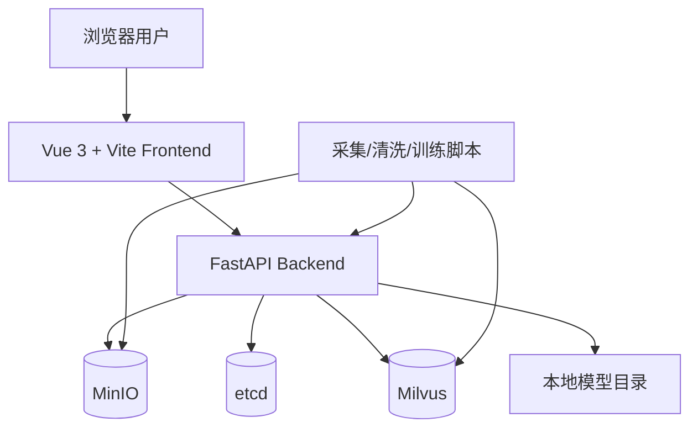
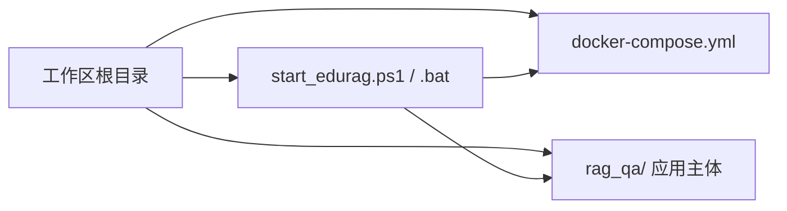
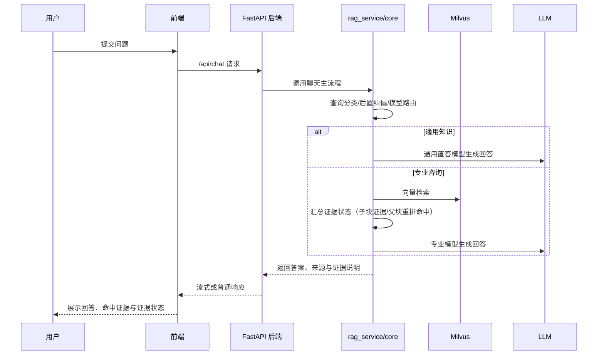
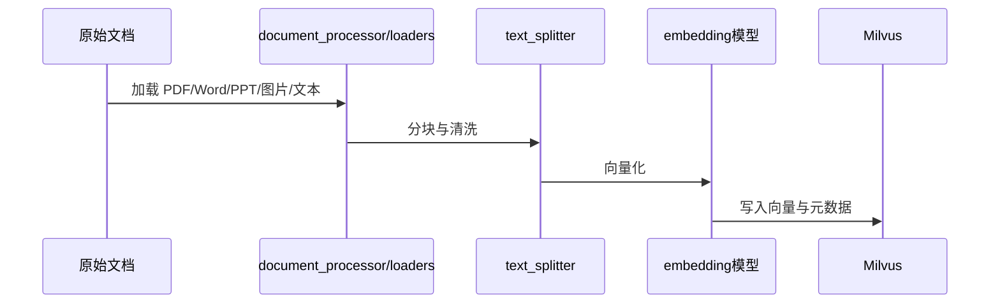
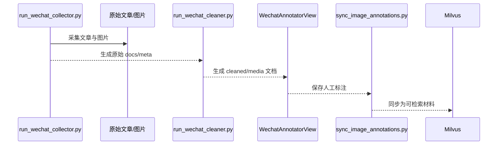

# EduRAG 系统架构说明

本文档面向技术交接、汇报和答辩，目标不是逐个接口列字段，而是说明这个系统由哪些层组成、如何运行、关键数据如何流动。

## 1. 系统定位

EduRAG 是一个面向采矿安全领域的 RAG 问答系统，当前仓库已经从早期脚本式实验演进为带 Web 前后端的工程化项目，核心能力包括：

- 基于 Milvus 的知识检索与问答
- FastAPI 后端 API
- Vue 3 前端交互界面
- 用户认证、会话管理、反馈、知识库版本管理
- 微信公众号采集、清洗、标注与入库链路

## 2. 运行拓扑

### 2.1 本地工程版运行拓扑

### 2.2 工作区与应用主体关系

说明：

- 工作区根目录负责启动编排和基础设施。
- `rag_qa/` 负责应用代码、模型、脚本和文档。
- 当前根目录启动器负责 MinIO、etcd 和 Milvus，并在其上启动本地 backend/frontend。

### 2.3 独立公众号标注模式

当只需要做公众号图片标注时，可以绕过主 RAG 问答、知识库和会话栈，直接使用 `web/backend/wechat_annotator_main.py`：

- 只暴露 `/api/wechat-annotator` 和 `/api/health`
- 默认运行在 `8001`
- 适合标注工作台、本地数据补录和轻量联调

## 3. 分层设计

### 3.1 前端层

前端位于 `web/frontend/`，技术栈为 Vue 3 + Vite + Element Plus。

当前前端主要职责：

- 登录与身份状态维护
- 问答页面与流式响应展示
- 知识库状态和系统配置展示
- 公众号采集与图片标注工作台

代表页面：

- `web/frontend/src/views/LoginView.vue`
- `web/frontend/src/views/ChatView.vue`
- `web/frontend/src/views/KnowledgeView.vue`
- `web/frontend/src/views/WechatAnnotatorView.vue`

### 3.2 后端 API 层

后端位于 `web/backend/`，主入口为 `web/backend/main.py`。

此外还有一个轻量入口 `web/backend/wechat_annotator_main.py`，只用于公众号标注场景，不导入聊天、知识库和会话主链路。

当前主路由分组包括：

- `/api/users`
- `/api/auth`
- `/api/feedback`
- `/api/kb-version`
- `/api/chat`
- `/api/sessions`
- `/api/knowledge`
- `/api/dataset`
- `/api/testgen`
- `/api/wechat-annotator`

后端承担的职责：

- HTTP API 暴露
- 请求日志、中间件、异常处理、健康检查、metrics
- 调用核心 RAG 逻辑和业务管理模块
- 对接 MinIO、Milvus 等依赖

### 3.3 核心业务层

核心业务主要分布在 `core/` 和少量 `web/backend/rag_service.py` 中。

代表模块：

| 模块 | 主要职责 |
| --- | --- |
| `core/vector_store.py` | 连接 Milvus、混合检索、重排序、知识统计 |
| `core/query_classifier.py` | 查询分类 |
| `core/strategy_selector.py` | 检索策略选择 |
| `core/conversation_manager.py` | 多轮对话状态管理 |
| `web/backend/rag_service.py` | 聊天主流程、流式输出、RAG/通用回答分流 |

### 3.4 数据处理与脚本层

这部分主要服务于知识构建、实验、采集和清洗。

代表文件：

- `run_wechat_collector.py`
- `run_wechat_cleaner.py`
- `sync_image_annotations.py`
- `rag_main.py`
- 多个 `analyze_*`、`build_*`、`generate_*`、`train_*` 脚本

这些脚本不等于主系统入口，但对数据生成、知识构建和实验验证非常重要。

## 4. 存储与依赖

### 4.1 MinIO

主要承载：

- 原始文件对象存储
- 业务文件上传后的对象化存放

当前本地工程模式下，MinIO 也由根目录 `docker-compose.yml` 管理，宿主机端口默认 `19000/19001`。

### 4.2 Milvus

主要承载：

- 文档向量存储
- 混合检索召回
- 知识库统计与查询

当前仓库的重要现实约束已经更新为：Milvus 已纳入根目录工程启动链路，由启动器和 Compose 自动拉起。

### 4.3 Etcd

主要承载：

- Milvus standalone 模式下的元数据协调

当前本地工程模式下，etcd 由根目录 `docker-compose.yml` 管理，作为 Milvus 的基础依赖之一。

### 4.4 本地模型目录

当前项目依赖本地模型目录，例如：

- `models/bge-m3`
- `models/bge-reranker-large`
- `macbert_query_classifier_v2/`
- `bert_query_classifier_new/`
- `bert_strategy_classifier/`

这意味着部署和迁移时，除了代码本身，还要考虑模型文件是否齐全。

其中查询分类器当前采用“双目录解析”策略：

- 优先加载 `macbert_query_classifier_v2/`
- 若该目录无效或不存在，则回退到 `bert_query_classifier_new/`

最新测试集中，MacBERT 查询分类器在通用/专业二分类上达到 100/100，显著优于旧 BERT 查询分类器的 70/100，改进点主要集中在“采矿语境下的通用问题”边界判别。

### 4.5 查询类型保护逻辑

运行时的最终 `query_type` 不只由查询分类模型单独决定，还会经过 `web/backend/rag_service.py` 的归一化和检索规划逻辑二次修正。

- `_normalize_query_type()` 负责把历史标签统一收敛为“通用知识/专业咨询”，并对代码、数学、通用 IT、日常生活等明显跨领域问题做硬规则降级。
- 现行版本已经去掉“只要出现领域词就硬拉为专业咨询”的激进规则，避免把“采矿语境下的通用问题”误送进知识库链路。
- `_promote_query_type_by_retrieval()` 只在同时满足领域信号、非边界负样本和可用 rerank 证据时，才把“通用知识”提升为“专业咨询”。
- `_prepare_query_plan()` 会结合父块 rerank 分数和子块检索分决定是否保留“专业咨询”路径，并额外生成 `evidence_note`、`evidence_status` 等证据状态，用于解释“为什么右侧命中了文档，但左侧仍认为证据不足”。

当前架构上的核心结论是：

1. “通用知识 / 专业咨询”已经从 prompt 级分流改成模型级分流。通用知识主回答走 `GENERAL_LLM_MODEL` 对应客户端，专业咨询主回答走 `LLM_MODEL`，而通用 LLM 对比回答只在显式触发时出现。
2. “明显专业问题被判成通用知识”与“通用问题被误送进知识库”都不应再简单归咎于 MacBERT 分类器本身，而应优先检查后端的归一化、提升与检索规划逻辑。
3. 高风险专业问题即使命中到主题相关父块，也不等于系统已经具备足够依据给出完整可执行方案；因此当前前后端都显式区分“主题命中”和“证据充分”。

### 4.6 可观测性（可选叠加）

当前工作区支持通过 `docker-compose.monitoring.yml` 叠加 Prometheus 和 Grafana：

- 后端暴露 `/metrics`
- Prometheus 默认映射到 `19090`
- Grafana 默认映射到 `13000`

这部分不是主链路必需依赖，但适合本地压测、答辩展示和问题排查。

## 5. 核心数据流

### 5.1 Web 问答流

### 5.2 知识构建与入库流

### 5.3 微信公众号链路

## 6. 当前部署形态

### 6.1 本地工程联调

这是当前最常用的形态：

- 后端本地运行
- 前端本地运行
- MinIO / etcd / Milvus 用 Docker Compose 管理

优点：

- 本地调试体验好
- 前后端改动反馈快
- 兼顾对象存储和向量检索依赖

### 6.2 脚本/实验模式

主要用于：

- 训练分类器
- 构建数据集
- 批量分析和实验
- 快速验证某条链路

这种模式下不一定经过 Web 层，但仍然依赖 `rag_qa/.venv`、配置文件和部分外部依赖。

### 6.3 公众号标注轻量模式

这是一个和主系统并行的轻量模式：

- 后端入口改为 `web/backend/wechat_annotator_main.py`
- 只服务公众号标注工作台
- 不依赖聊天、知识库、会话主链路

优点：

- 启动更轻
- 数据标注问题更容易隔离定位
- 不必等主 RAG 链路完全可用

### 6.4 容器化与监控叠加模式

除本地工程联调外，仓库还提供两种补充模式：

- `docker-compose.yml`：可拉起 backend/frontend 容器，用于容器化验证或部署预演
- `docker-compose.monitoring.yml`：在现有网络上叠加 Prometheus / Grafana
- `docker-compose.prod.yml`：要求显式提供敏感凭据，并关闭 MinIO 宿主机暴露端口

这几种模式是补充形态，不改变当前“本地 backend/frontend + Compose MinIO/etcd/Milvus”仍是默认开发事实。

## 7. 当前技术边界和风险点

### 7.1 Milvus 仍是完整能力的关键依赖

这是当前最容易误解的地方。即使 Milvus 已纳入一键启动，工程启动成功也不等于 RAG 检索链路一定可用，因为容器异常、连接失败或集合状态异常都会让知识链路失效。

### 7.2 文档、脚本和工程入口并存

仓库同时存在：

- 当前工程化入口
- 历史脚本与实验文件
- 数据构建与训练脚本

另外，`ragas_paper_bundle/` 和 `rag_assesment/` 这类目录主要服务于实验、论文展示和数据准备，不能直接等同于 Web 主系统运行入口。

因此新成员如果直接从根目录脚本海洋开始读，很容易偏离主链路。

### 7.3 模型与数据体积较大

当前项目不只是代码仓，还是模型与数据仓。迁移环境时，缺的不一定是代码，往往是模型目录、Milvus 数据或对象存储内容。

### 7.4 知识库统计存在 Milvus 查询窗口约束

这一点已经在 `TECHNICAL_HANDBOOK.md` 中明确记录：大窗口查询需要限制或降级，否则会触发 Milvus 的结果窗口错误。

## 8. 用于答辩或交接时怎么讲

如果要在 3 到 5 分钟内讲清楚这个系统，建议按下面顺序：

1. 它是一个采矿安全领域的 RAG 系统，不只是聊天页，而是完整的前后端工程。
2. 工作区根目录负责启动编排，`rag_qa/` 负责应用主体。
3. 前端用 Vue 3，后端用 FastAPI，核心检索依赖 Milvus，原始文件走 MinIO，用户/会话/反馈等业务状态当前主要落本地 JSON。
4. 问答链路是“分类 -> 检索策略选择 -> Milvus 检索 -> LLM 生成 -> 前端展示引用”。
5. 项目还有一条公众号数据链路，支持“采集 -> 清洗 -> 标注 -> 入库”。
6. 当前工程化程度已经覆盖启动器、任务、自检、日志、监控入口，但完整能力仍依赖 MinIO、Milvus 和模型目录都处于可用状态。

## 9. 相关文档

- `README.md`：应用层快速开始与 API 总览
- `项目使用指南.md`：当前工程版运行和联调手册
- `TECHNICAL_HANDBOOK.md`：快速接手文档
- `PROJECT_STRUCTURE.md`：目录结构说明
- `文档索引.md`：文档导航页